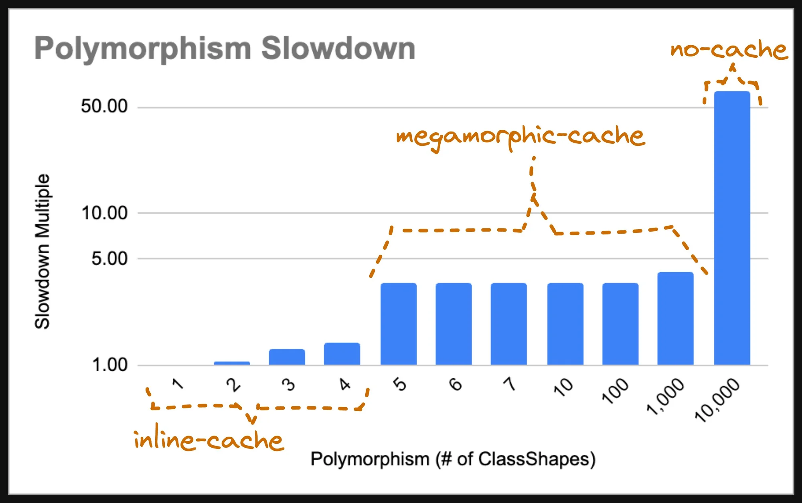

# XxxMorphism

A quick overview of the internals of V8 and their impacts on performance

<span style="font-size: 0.5em; opacity: 0.5">The following slides have been made for internal purposes, they include images coming from https://mathiasbynens.be/notes/shapes-ics</span>

---

## What is V8?

<v-clicks>

- JavaScript Engine
- Powering Chrome (78% of Desktop, 65% of Mobile)
- Powering Node

</v-clicks>

---

## Parsing code


<v-clicks>

And the idea is the same for all engines.

</v-clicks>

---

## An object in JavaScript

<v-clicks>

According to the ECMAScript specification:

</v-clicks>

<v-clicks>

- An object is a dictionary
- Every property defines:
  - value or get/set
  - configurable — _type can be edited and property can be deleted_
  - enumerable — _property shows up during enumeration_
  - writable — _value associated with the property can be changed_

</v-clicks>

<v-clicks>


</v-clicks>

---

## Implications?

<v-clicks>

Lots of memory being duplicated

</v-clicks>

---

## Shapes to the rescue

<v-clicks>


</v-clicks>

<v-clicks>

```js
instance = {
  shape, // some kind of dictionary mapping a name to a property or nothing
  data, // some kind of array
};
```

</v-clicks>

---

## Implications?

<v-clicks>

```js
function getX(o) {
  return o.x;
}
```

</v-clicks>

<v-clicks>

If we were to implement a JavaScript interpreter it would do something like:

</v-clicks>

<v-clicks>

```js
function getX(o) {
  const property = o.shape.get("x"); // accessing entry in an hashmap
  if (property === undefined) {
    return undefined;
  }
  if ("get" in property) {
    return property.get();
  }
  if ("set" in property) {
    return undefined;
  }
  return o.data[property.offset];
}
```

</v-clicks>

<v-clicks>

Well, actually highly simplified as we can have values coming from the prototype chain...

</v-clicks>

---

## Implications with prototype chain?

<v-clicks>

```js
function getX(o) {
  let current = o;
  do {
    const property = current.shape.get("x"); // accessing entry in an hashmap
    if (property === undefined) {
      current = current.prototype;
      continue;
    }
    if ("get" in property) {
      return property.get();
    }
    if ("set" in property) {
      return undefined;
    }
    return current.data[property.offset];
  } while (current !== undefined);

  return undefined;
}
```

</v-clicks>

<v-clicks>

Hopefully JavaScript engines don't do that...

</v-clicks>

<v-clicks>

...more precisely not all the time

</v-clicks>

---

## Simplified behavior

---

## Simplified behavior (step #1)


---

## Simplified behavior (step #2)


---

## Simplified behavior (step #3)


---

## Simplified behavior (step #4)


---

## But...

<v-clicks>

What if I have multiple shapes?

</v-clicks>

<v-clicks>


</v-clicks>

---

## XxxMorphism?

<v-clicks>

- Monomorphism: 1 shape
- Polymorphism: up to 4 shapes
- Megamorphism: up to 1024 shapes
- Major de-opt

</v-clicks>

---

## Let's measure the impact

```js
function randomKey() {
  return 'r:' + Math.random();
}
function buildGetX(numberOfClasses: number) {
  function getX(obj: { x: number }) {
    return obj.x;
  }
  let entries: { x: number }[] = [];
  for (let i = 0; i !== numberOfClasses; ++i) {
    entries.push({
      [randomKey()]: Math.random(),
      [randomKey()]: Math.random(),
      [randomKey()]: Math.random(),
      x: Math.random(),
    });
  }
  const targetSize = 10_000;
  while (entries.length < targetSize) {
    entries = [...entries, ...entries];
  }
  return { getX, entries: entries.slice(0, targetSize) };
}
```

---

## Let's measure the impact

```js
const { getX: get1, entries: entries1 } = buildGetX(1);
const { getX: get2, entries: entries2 } = buildGetX(2);
const { getX: get3, entries: entries3 } = buildGetX(3);
const { getX: get4, entries: entries4 } = buildGetX(4);
const { getX: get5, entries: entries5 } = buildGetX(5);
const { getX: get6, entries: entries6 } = buildGetX(6);
const { getX: get7, entries: entries7 } = buildGetX(7);
const { getX: get10, entries: entries10 } = buildGetX(10);
const { getX: get100, entries: entries100 } = buildGetX(100);
const { getX: get1000, entries: entries1000 } = buildGetX(1000);
const { getX: get10000, entries: entries10000 } = buildGetX(10000);

bench("xxxmorphism", {
  morphism1: () => entries1.forEach(get1),
  morphism2: () => entries2.forEach(get2),
  morphism3: () => entries3.forEach(get3),
  morphism4: () => entries4.forEach(get4),
  morphism5: () => entries5.forEach(get5),
  morphism6: () => entries6.forEach(get6),
  morphism7: () => entries7.forEach(get7),
  morphism10: () => entries10.forEach(get10),
  morphism100: () => entries100.forEach(get100),
  morphism1000: () => entries1000.forEach(get1000),
  morphism10000: () => entries10000.forEach(get10000),
});
```

---

## Let's measure the impact

```txt
┌─────────┬─────────────-──────┬──────────┬─────────────-───────┬──────────┬─────────┐
│ (index) │     Task Name     │ ops/sec  │ Average Time (ns)  │  Margin  │ Samples │
├─────────┼────────-───────────┼──────────┼─────────────-───────┼──────────┼─────────┤
│    0    │    'morphism1'    │ '30 553' │ 32729.822609149167 │ '±1.16%' │  15277  │
│    1    │    'morphism2'    │ '30 856' │ 32408.380322767647 │ '±1.09%' │  15429  │
│    2    │    'morphism3'    │ '32 205' │ 31050.493696827052 │ '±1.04%' │  16103  │
│    3    │    'morphism4'    │ '32 189' │ 31065.73895757239  │ '±1.04%' │  16097  │
│    4    │    'morphism5'    │ '31 898' │ 31349.76496396425  │ '±1.08%' │  15955  │
│    5    │    'morphism6'    │ '31 577' │ 31668.294382165535 │ '±1.04%' │  15789  │
│    6    │    'morphism7'    │ '32 191' │ 31064.24577534342  │ '±0.99%' │  16096  │
│    7    │   'morphism10'    │ '32 191' │ 31064.35981860147  │ '±1.03%' │  16097  │
│    8    │   'morphism100'   │ '30 764' │ 32505.103035816268 │ '±0.95%' │  15383  │
│    9    │  'morphism1000'   │ '14 915' │ 67043.99999999952  │ '±0.90%' │  10000  │
│   10    │  'morphism10000'  │ '1 173'  │ 852155.9699999937  │ '±0.48%' │  10000  │
└─────────┴─────────────-──────┴──────────┴──────────-──────────┴──────────┴─────────┘
```

Calling `getX` on 10k items. With `n` in `morphism(n)` being the number of distinct shapes.

---

## Other stats



Source: https://www.builder.io/blog/monomorphic-javascript

---

## Take aways

<v-clicks>

- Shapes are impactful
- Micro-benchmarking can hide shape related issues
- Polymorphic functions are harmful (for performance but super for reusability)

</v-clicks>
