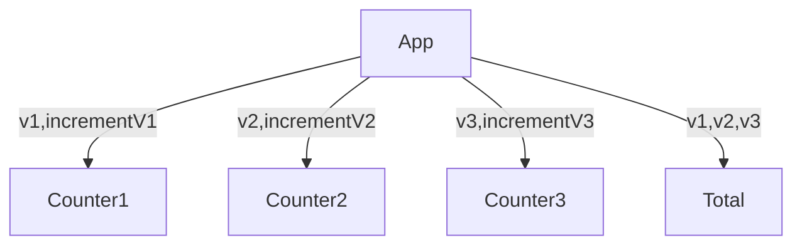
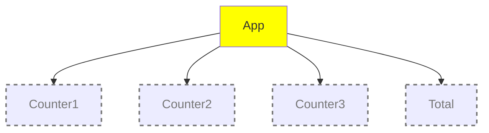
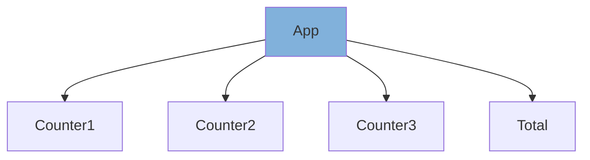
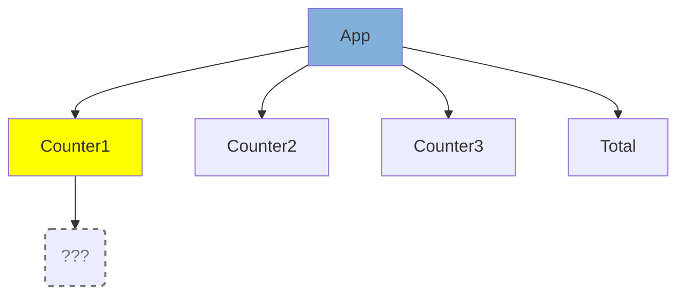
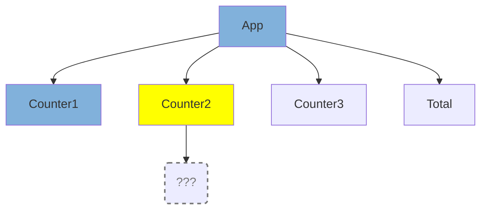
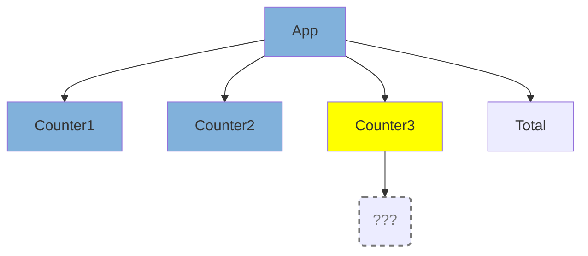
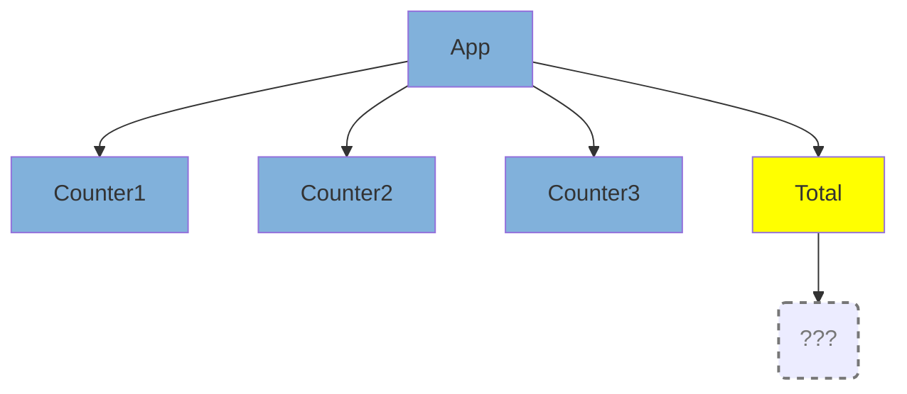
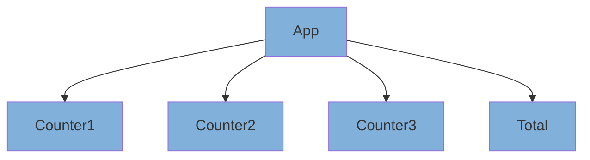

<!---
https://x.com/posva/status/1198918347599106049

https://x.com/bernhardsson/status/1523763748200382464?t=-pZG5v8Fv8STgEnOK6pkGQ

https://x.com/rorypreddy/status/1142967056150728708

Maybe for conclusion?
https://www.linkedin.com/posts/alexis-hamann-845a74102_quand-tu-fais-un-hotfix-en-prod-ugcPost-6580374814211604480-A9xM/
-->

<div style="display:flex; justify-content: center; margin-bottom: 16px;">
  
</div>

<h1 style="color: #fff !important">Fine-Grained reactivity without any compiler</h1>

_How did we achieve fine-grained reactivity at Pigment?_

_**by Nicolas DUBIEN**_

---
layout: center
---

# What is reactivity? 🤔

---

## Let's consider a basic example

<div style="display: grid;">
<v-switch>
<template #1>
<div style="grid-row: 1; grid-column: 1;">


</div>
</template>
<template #2>
<div style="grid-row: 1; grid-column: 1">

<div grid="~ cols-2 gap-16">

<div style="padding-top: 48px">



</div>


</div>

</div>
</template>
<template #3>
<div style="grid-row: 1; grid-column: 1">

<div grid="~ cols-2 gap-16">

<div style="padding-top: 48px">


</div>


</div>

</div>
</template>
</v-switch>
</div>

---
layout: center
---


---
layout: center
---


---

## Compiler to the rescue

<div v-click>


More details about the compiler at https://react.dev/learn/react-compiler

</div>

---
zoom: 1.0
---


````md magic-move {lines: true}
```tsx
function App() {
  const [value1, setValue1] = useState(0);
  const [value2, setValue2] = useState(0);
  const [value3, setValue3] = useState(0);

  return (
    <div>
      <Counter value={value1} increment={() => setValue1((v) => v + 1)} />
      <Counter value={value2} increment={() => setValue2((v) => v + 1)} />
      <Counter value={value3} increment={() => setValue3((v) => v + 1)} />
      <Total value1={value1} value2={value2} value3={value3} />
    </div>
  );
}
```

```js
function App() {
  const $ = _c(18);
  const [value1, setValue1] = useState(0);
  const [value2, setValue2] = useState(0);
  const [value3, setValue3] = useState(0);
  let t0;
  if ($[0] === Symbol.for("react.memo_cache_sentinel")) {
    t0 = () => setValue1((v) => v + 1);
    $[0] = t0;
  } else {
    t0 = $[0];
  }

  let t1;
  if ($[1] !== value1) {
    t1 = <Counter value={value1} increment={t0} />;
    $[1] = value1;
    $[2] = t1;
  } else {
    t1 = $[2];
  }

  let t2;
  if ($[3] === Symbol.for("react.memo_cache_sentinel")) {
    t2 = () => setValue2((v_0) => v_0 + 1);

    $[3] = t2;
  } else {
    t2 = $[3];
  }

  let t3;
  if ($[4] !== value2) {
    t3 = <Counter value={value2} increment={t2} />;
    $[4] = value2;
    $[5] = t3;
  } else {
    t3 = $[5];
  }

  let t4;
  if ($[6] === Symbol.for("react.memo_cache_sentinel")) {
    t4 = () => setValue3((v_1) => v_1 + 1);
    $[6] = t4;
  } else {
    t4 = $[6];
  }

  let t5;
  if ($[7] !== value3) {
    t5 = <Counter value={value3} increment={t4} />;
    $[7] = value3;
    $[8] = t5;
  } else {
    t5 = $[8];
  }

  let t6;
  if ($[9] !== value1 || $[10] !== value2 || $[11] !== value3) {
    t6 = <Total value1={value1} value2={value2} value3={value3} />;
    $[9] = value1;
    $[10] = value2;
    $[11] = value3;
    $[12] = t6;
  } else {
    t6 = $[12];
  }

  let t7;
  if ($[13] !== t1 || $[14] !== t3 || $[15] !== t5 || $[16] !== t6) {
    t7 = (
      <div>
        {t1}
        {t3}
        {t5}
        {t6}
      </div>
    );
    $[13] = t1;
    $[14] = t3;
    $[15] = t5;
    $[16] = t6;
    $[17] = t7;
  } else {
    t7 = $[17];
  }

  return t7;
}
```
````

---
zoom: 0.28
---


```js
function App() {
  const $ = _c(18);
  const [value1, setValue1] = useState(0);
  const [value2, setValue2] = useState(0);
  const [value3, setValue3] = useState(0);
  let t0;
  if ($[0] === Symbol.for("react.memo_cache_sentinel")) {
    t0 = () => setValue1((v) => v + 1);
    $[0] = t0;
  } else {
    t0 = $[0];
  }

  let t1;
  if ($[1] !== value1) {
    t1 = <Counter value={value1} increment={t0} />;
    $[1] = value1;
    $[2] = t1;
  } else {
    t1 = $[2];
  }

  let t2;
  if ($[3] === Symbol.for("react.memo_cache_sentinel")) {
    t2 = () => setValue2((v_0) => v_0 + 1);

    $[3] = t2;
  } else {
    t2 = $[3];
  }

  let t3;
  if ($[4] !== value2) {
    t3 = <Counter value={value2} increment={t2} />;
    $[4] = value2;
    $[5] = t3;
  } else {
    t3 = $[5];
  }

  let t4;
  if ($[6] === Symbol.for("react.memo_cache_sentinel")) {
    t4 = () => setValue3((v_1) => v_1 + 1);
    $[6] = t4;
  } else {
    t4 = $[6];
  }

  let t5;
  if ($[7] !== value3) {
    t5 = <Counter value={value3} increment={t4} />;
    $[7] = value3;
    $[8] = t5;
  } else {
    t5 = $[8];
  }

  let t6;
  if ($[9] !== value1 || $[10] !== value2 || $[11] !== value3) {
    t6 = <Total value1={value1} value2={value2} value3={value3} />;
    $[9] = value1;
    $[10] = value2;
    $[11] = value3;
    $[12] = t6;
  } else {
    t6 = $[12];
  }

  let t7;
  if ($[13] !== t1 || $[14] !== t3 || $[15] !== t5 || $[16] !== t6) {
    t7 = (
      <div>
        {t1}
        {t3}
        {t5}
        {t6}
      </div>
    );
    $[13] = t1;
    $[14] = t3;
    $[15] = t5;
    $[16] = t6;
    $[17] = t7;
  } else {
    t7 = $[17];
  }

  return t7;
}
```

---
layout: center
---


<!--
While the compiler looks promising,

1. It does not solve all the reactivity issues, but mostly simple ones. It cannot be as tailored as a very custom piece of optimization.
2. It has extra runtime costs. I recommend you to play with the REPL and playground to see the generated code. While not huge, that's still an overhead that might be useless in many cases for very optimized apps.

That said it should cover most of the cases for free. As such it's definitely a great option to use (once ready)!
-->

---
layout: center
---

# Is the compiler enough?

# Do I need a compiler?

# ...

---
layout: center
---

# Let's talk about fine-grained reactivity

---
layout: cover
background: /assets/wallpaper-1.jpg
---

<div>
  
</div>

<div style="margin-top: 48px"></div>
<h1 style="color: #fff !important">Nicolas DUBIEN</h1>
<div style="display: flex; justify-content: center; font-size: 1.2em; margin-top: -20px; align-items: end;">
  <span style="margin-top: 0.7em">
    Software Engineer at&nbsp;
  </span>
  
</div>
<div style="opacity: 0.5">
 <a href="https://engineering.pigment.com/" target="_blank">engineering.pigment.com</a>
</div>

<div style="margin-top: 48px"></div>
<div style="display: flex; gap: 8px; color: #ffffff; vertical-align: middle;">
  
  dubzzz
</div>
<div style="display: flex; gap: 8px; color: #ffffff; vertical-align: middle;">
  
  ndubien
</div>
<div style="display: flex; gap: 8px; color: #ffffff; vertical-align: middle;">
  
  fast-check
</div>

---
layout: center
---

# How to make our application reactive?

---

## Whenever a state changes

<ul>
<li v-click>A render cycle starts...</li>
<li v-click>Starting from the component holding the updated state...</li>
<li v-click>And traversing the component tree until it reaches <i>leaves</i></li>
</ul>

<div style="display: grid;">
<v-switch>
<template #1>
<div style="grid-row: 1; grid-column: 1;">



</div>
</template>
<template #2>
<div style="grid-row: 1; grid-column: 1;">



</div>
</template>
<template #3>
<div style="grid-row: 1; grid-column: 1;">



</div>
</template>
<template #4>
<div style="grid-row: 1; grid-column: 1;">



</div>
</template>
<template #5>
<div style="grid-row: 1; grid-column: 1;">



</div>
</template>
<template #6>
<div style="grid-row: 1; grid-column: 1;">



</div>
</template>
<template #7>
<div style="grid-row: 1; grid-column: 1;">



</div>
</template>
</v-switch>
</div>

---

## Why did it re-render?

<ul>

<li v-click="1">The state of the component changed?</li>
<li v-click="2">The component instantiating this component re-rendered?</li>
<li v-click="3">The component relies on a provider whose value changed?</li>

</ul>

---

## How to avoid re-render?

<ul>

<li v-click="1">
  Wrap the component within <kbd>React.memo</kbd>
  <ul>
    <li v-click="2">But props passed to the component have to be stabilized, possibly with <kbd>useMemo</kbd> and <kbd>useCallback</kbd></li>
    <li v-click="3">It cannot protect from a provider</li>
  </ul>
</li>
<li v-click="4">Move the state closer to the leaves</li>

</ul>

---
zoom: 1.0
---

## Let's improve our counter case!

````md magic-move {lines: true}
```tsx
import { useState } from "react";
import Counter from "./Counter";
import Total from "./Total";

export default function App() {
  const [value1, setValue1] = useState(0);
  const [value2, setValue2] = useState(0);
  const [value3, setValue3] = useState(0);

  return (
    <div>
      <Counter value={value1} increment={() => setValue1((v) => v + 1)} />
      <Counter value={value2} increment={() => setValue2((v) => v + 1)} />
      <Counter value={value3} increment={() => setValue3((v) => v + 1)} />
      <Total value1={value1} value2={value2} value3={value3} />
    </div>
  );
}
```

```tsx
import { memo, useState } from "react";
import _Counter from "./Counter";
import Total from "./Total";

const Counter = memo(_Counter);

export default function App() {
  const [value1, setValue1] = useState(0);
  const [value2, setValue2] = useState(0);
  const [value3, setValue3] = useState(0);

  return (
    <div>
      <Counter value={value1} increment={() => setValue1((v) => v + 1)} />
      <Counter value={value2} increment={() => setValue2((v) => v + 1)} />
      <Counter value={value3} increment={() => setValue3((v) => v + 1)} />
      <Total value1={value1} value2={value2} value3={value3} />
    </div>
  );
}
```

```tsx
import { memo, useCallback, useState } from "react";
import _Counter from "./Counter";
import Total from "./Total";

const Counter = memo(_Counter);

export default function App() {
  const [value1, setValue1] = useState(0);
  const [value2, setValue2] = useState(0);
  const [value3, setValue3] = useState(0);

  const increment1 = useCallback(() => setValue1((v) => v + 1), []);
  const increment2 = useCallback(() => setValue2((v) => v + 1), []);
  const increment3 = useCallback(() => setValue3((v) => v + 1), []);

  return (
    <div>
      <Counter value={value1} increment={increment1} />
      <Counter value={value2} increment={increment2} />
      <Counter value={value3} increment={increment3} />
      <Total value1={value1} value2={value2} value3={value3} />
    </div>
  );
}
```
````

---
layout: center
---

# Problem solved?

---
layout: center
---

# Let's discuss of Pigment

---

## Boards at Pigment

<div style="display: grid; grid-template-columns: 2fr 1fr">


<div style="grid-row: 1; grid-column: 2">

<ul>
<li v-click="1">Real-time data and figures</li>
<li v-click="2">Huge datasets possibly reaching several millions of cells</li>
<li v-click="4">Real-time labels synchronized and shared between components</li>
</ul>

</div>
</div>

<!--
At Pigment we can have multiple grids, charts, KPIs, texts... all displayed on the same page.
All of them being live-updated and sharing data between each others.
-->

---

## Grids at Pigment


---

## Let's take a simplified grid implementation


<v-switch>
<template #1>

- lines: _data in a CSV fashion_
- columns/rows: _columns of the CSV to use as columns (resp. rows)_

</template>
<template #2>

```js
const lines = [
  { Kind: 'Sussex', Hen: 'Bianca' , Year: '2020', value: 166 },
  { Kind: 'Sussex', Hen: 'Bianca' , Year: '2021', value: 184 },
  { Kind: 'Sussex', Hen: 'Bianca' , Year: '2022', value:  54 },
  { Kind: 'Sussex', Hen: 'Bernard', Year: '2020', value: 130 },
  //...
];
const columns = ["Kind", "Hen"];
const rows = ["Year"];
```

</template>
</v-switch>

---
zoom: 1.0
---

## A simpler grid

```tsx
export default function Grid(props: Props) {
  const { lines, columnHeaderIds, rowHeaderIds } = props;

  const columnsHeaders = buildHeaders(lines, columnHeaderIds, 0);
  const columnsSpans = extractHeaderSpans(columnsHeaders);
  const columnsPaths = extractPathsFromSpans(columnsSpans);

  const rowsHeaders = buildHeaders(lines, rowHeaderIds, 0);
  const rowsSpans = extractHeaderSpans(rowsHeaders);
  const rowsPaths = extractPathsFromSpans(rowsSpans);

  return (
    <div>
      <Rows rowsSpans={rowsSpans} columnsDepth={columnsSpans.length} />
      <Columns columnsSpans={columnsSpans} rowsDepth={rowsSpans.length} />
      <Cells rowsPaths={rowsPaths} columnsPaths={columnsPaths} lines={lines} rowsDepth={rowsSpans.length} columnsDepth={columnsSpans.length} />
    </div>
  );
}
```

<p style="text-align: right">

[github.com/dubzzz/reactivity-comparison](https://github.com/dubzzz/reactivity-comparison/tree/main/stacks/react)

</p>

<!--
  There are several reasons to do the pivoting in front side. One of them being to make the UI as fluid as possible.
  By avoiding calling the back whenever the user scrolls we come with a very efficient UI.

  The algorithm precomputes the whole pivoted tree and do not push the computation down to the cells.
  One of the reason being that we are highly depending on virtualization and need to quickly now the cell at a precise location.

  Without React compiler the code sucks!
-->

---
zoom: 1.0
---

## A simpler grid in action

```tsx
export default function App() {
  const [lines, setLines] = useState([]);

  return (
    <div>
      <HeaderButtons refreshLines={newLines => setLines(newLines)} />
      <Grid lines={lines} rowHeaderIds={["Country", "Town"]} columnHeaderIds={["Product"]} />
    </div>
  );
}
```

<p style="text-align: right">

[github.com/dubzzz/reactivity-comparison](https://github.com/dubzzz/reactivity-comparison/tree/main/stacks/react)

</p>

---

## Let's play with it!


---

<h2>React Compiler to the rescue<span v-click.hide="2" style="position: absolute">🦸</span><span v-click="2" style="position: absolute">😭</span></h2>

<div v-click="1">

</div>

---
zoom: 1.0
---

## Let's take back our `<App/>` component

```tsx {all|2}
export default function App() {
  const [lines, setLines] = useState([]);

  return (
    <div>
      <HeaderButtons refreshLines={newLines => setLines(newLines)} />
      <Grid lines={lines} rowHeaderIds={["Country", "Town"]} columnHeaderIds={["Product"]} />
    </div>
  );
}
```

<!--
Let's take back our <App/> component. As seen previously going with native primitives offered by React could work (and at the end we will rely on them under-the-scene)
but can be very verbose and request us to change a lot the code.

So we want to superseed and replace some usages of React's primitives with some new primitives we will come up with and that should not break DX.
-->


---
zoom: 2.0
---

````md magic-move {lines: true}
```tsx
// ...
const [lines, setLines] = useState([]);
// ...
```

```tsx
// ...
const [lines, setLines] = useShell([]);
// ...
```
````

<!--
So we want to replace useState by something that will be as simple to use but way more reactive by default.
Note that we may drop some of the useful invariants offered by useState for the sake of reactivity (such as all states updates at the same time so there is no offset by one frame issues).
-->

---

<div style="display: grid; padding-top: 100px">
<v-switch>
<template #0>
<div style="grid-row: 1; grid-column: 1;">


</div>
</template>
<template #1>
<div style="grid-row: 1; grid-column: 1;">


</div>
</template>
</v-switch>
</div>

---

<div style="display: grid; padding-top: 100px">
<v-switch>
<template #0>
<div style="grid-row: 1; grid-column: 1;">


</div>
</template>
<template #1>
<div style="grid-row: 1; grid-column: 1;">


</div>
</template>
</v-switch>
</div>

---
zoom: 1.0
---

````md magic-move {lines: true}
```tsx
function useShell<T>(initialValue: T): [value: Shell<T>, setter: (nextValue: T) => void] {
  // Not implemented!
}
```

```tsx
type Shell<T> = BehaviorSubject<T>;

function useShell<T>(initialValue: T): [value$: Shell<T>, setter: (nextValue: T) => void] {
  // Not implemented!
}
```

```tsx
type Shell<T> = BehaviorSubject<T>;

function useShell<T>(initialValue: T): [value$: Shell<T>, setter: (nextValue: T) => void] {
  const [value$] = useState(() => new BehaviorSubject(initialValue));
  const [setter] = useState(() => (nextValue: T) => value$.next(nextValue));
  return [value$, setter];
}
```
````

---
zoom: 1.0
---

## Let's use the shell within our `<Grid/>` component

```tsx {all|4,5,6}
export default function Grid(props: Props) {
  const { lines, columnHeaderIds, rowHeaderIds } = props;

  const columnsHeaders = buildHeaders(lines, columnHeaderIds, 0);
  const columnsSpans = extractHeaderSpans(columnsHeaders);
  const columnsPaths = extractPathsFromSpans(columnsSpans);

  const rowsHeaders = buildHeaders(lines, rowHeaderIds, 0);
  const rowsSpans = extractHeaderSpans(rowsHeaders);
  const rowsPaths = extractPathsFromSpans(rowsSpans);

  return (
    <div>
      <Rows rowsSpans={rowsSpans} columnsDepth={columnsSpans.length} />
      <Columns columnsSpans={columnsSpans} rowsDepth={rowsSpans.length} />
      <Cells rowsPaths={rowsPaths} columnsPaths={columnsPaths} lines={lines} rowsDepth={rowsSpans.length} columnsDepth={columnsSpans.length} />
    </div>
  );
}
```

---
zoom: 1.5
---

````md magic-move {lines: true}
```tsx
const columnsHeaders = buildHeaders(lines, columnHeaderIds, 0);
const columnsSpans = extractHeaderSpans(columnsHeaders);
const columnsPaths = extractPathsFromSpans(columnsSpans);
```

```tsx
const columnsHeaders$ = useComputed(
  lines => buildHeaders(lines, columnHeaderIds, 0),
  [lines$],
);
const columnsSpans$ = useComputed(
  columnsHeaders => extractHeaderSpans(columnsHeaders),
  [columnsHeaders$],
);
const columnsPaths$ = useComputed(
  columnsSpans => extractPathsFromSpans(columnsSpans),
  [columnsSpans$],
);
```
````

---

<div style="display: grid; padding-top: 100px">


</div>

---
zoom: 1.2
---

````md magic-move {lines: true}
```tsx
function useComputed<T, U>(transform: (value: T) => U, [shell$]: [Shell<T>]): Shell<U> {
  // Not implemented!
}
```

```tsx
function useComputed<T, U>(transform: (value: T) => U, [shell$]: [Shell<T>]): Shell<U> {
  const [mappedShell$, setter] = useShell(transform(readSync(shell$)));
  // We need to update the mappedShell whenever the source shell receives an update
  return mappedShell$;
}
```

```tsx
function useComputed<T, U>(transform: (value: T) => U, [shell$]: [Shell<T>]): Shell<U> {
  const [mappedShell$, setter] = useShell(transform(readSync(shell$)));
  useEffect(() => {
    const subscription = shell$.subscribe((value) => setter(transform(value)));
    return () => subscription.unsubscribe();
  }, [shell$, setter, transform]);
  return mappedShell$;
}
```
````

---
zoom: 1.0
---

## Let's unwrap the shell within our `<Grid/>` component

```tsx {all|11}
export default function Grid(props: Props) {
  const { lines$, columnHeaderIds, rowHeaderIds } = props;

  const columnsHeaders$ = useComputed(lines => buildHeaders(lines, columnHeaderIds, 0), [lines$]);
  const columnsSpans$ = useComputed(columnsHeaders => extractHeaderSpans(columnsHeaders), [columnsHeaders$]);
  const columnsPaths$ = useComputed(columnsSpans => extractPathsFromSpans(columnsSpans), [columnsSpans$]);
  // Same for rows...

  return (
    <div>
      <Rows rowsSpans={rowsSpans$} columnsDepth={columnsSpans.length} />
      <Columns columnsSpans={columnsSpans$} rowsDepth={rowsSpans.length} />
      <Cells rowsPaths={rowsPaths$} columnsPaths={columnsPaths$} lines={lines$} rowsDepth={rowsSpans.length} columnsDepth={columnsSpans.length} />
    </div>
  );
}
```

---
zoom: 1.5
---

````md magic-move {lines: true}
```tsx
const columnsDepth = columnsSpans.length;
```

```tsx
const columnsDepth$ = useComputed(
  columnsSpans => columnsSpans.length,
  [columnsSpans$]
);
const columnsDepth = ???;
```

```tsx
const columnsDepth$ = useComputed(
  columnsSpans => columnsSpans.length,
  [columnsSpans$]
);
const columnsDepth = useWatch(columnsDepth$);
```
````

---

<div style="display: grid; padding-top: 100px">


</div>

---
zoom: 1.5
---

````md magic-move {lines: true}
```tsx
function useWatch<T>(shell$: Shell<T>): T {
  // Not implemented!
}
```

```tsx
function useWatch<T>(shell$: Shell<T>): T {
  const subscribe = "???";
  const getSnapshot = "???";
  return useSyncExternalStore(subscribe, getSnapshot);
}
```

```tsx
function useWatch<T>(shell$: Shell<T>): T {
  const subscribe = useCallback(
    (onChange: () => void): (() => void) => {
      const subscription = shell$.subscribe(onChange);
      return () => subscription.unsubscribe();
    },
    [shell$]
  );
  const getSnapshot = "???";
  return useSyncExternalStore(subscribe, getSnapshot);
}
```

```tsx
function useWatch<T>(shell$: Shell<T>): T {
  const subscribe = useCallback(
    (onChange: () => void): (() => void) => {
      const subscription = shell$.subscribe(onChange);
      return () => subscription.unsubscribe();
    },
    [shell$]
  );
  const getSnapshot = useCallback(() => readSync(shell$), [shell$]);
  return useSyncExternalStore(subscribe, getSnapshot);
}
```
````

---

## Designing our reactivity primitives

<ul>
<li v-click>Reactivity is all about <b>controlling states</b> and <b>their updates</b></li>
<li v-click>Default primitives such as <kbd>memo</kbd>, <kbd>useMemo</kbd>... are low level and require rethinking the code</li>
</ul>

<h3 v-click style="padding-top: 24px">What if we could have the DX of <kbd>useState</kbd> but with reactivity?</h3>

---
zoom: 1.0
---

## Let's take the parent component of <kbd>Grid</kbd>

````md magic-move {lines: true}
```tsx
function usePipe<T>(initialValue: T): [value: Shell<T>, setter: (nextValue: T) => void] {
  // Not implemented!
}
```

```tsx
type Shell<T> = BehaviorSubject<T>;

function usePipe<T>(initialValue: T): [value$: Shell<T>, setter: (nextValue: T) => void] {
  const [value$] = useState(() => new BehaviorSubject(initialValue));
  const [setter] = useState(() => (nextValue: T) => value$.next(nextValue));
  return [value$, setter];
}
```

```tsx
type Shell<T> = BehaviorSubject<T>;

function usePipe<T>(initialValue: T): [value$: Shell<T>, setter: (nextValue: T) => void] {
  const [value$] = useState(() => new BehaviorSubject(initialValue));
  const [setter] = useState(() => (nextValue: T) => {
    if (!isEqual(nextValue, readSync(value$))) {
      value$.next(nextValue);
    }
  });
  return [value$, setter];
}
```
````

---
zoom: 1.0
---

## Let's take <kbd>Grid</kbd>

````md magic-move {lines: true}
```tsx
export default function Grid(props: Props) {
  const { lines, columnHeaderIds, rowHeaderIds } = props;

  const columnsHeaders = buildHeaders(lines, columnHeaderIds, 0);
  const columnsSpans = extractHeaderSpans(columnsHeaders);
  const columnsPaths = extractPathsFromSpans(columnsSpans);
  // Same for rows...

  return (
    <div>
      <Rows rowsSpans={rowsSpans} columnsDepth={columnsSpans.length} />
      <Columns columnsSpans={columnsSpans} rowsDepth={rowsSpans.length} />
      <Cells rowsPaths={rowsPaths} columnsPaths={columnsPaths} lines={lines} rowsDepth={rowsSpans.length} columnsDepth={columnsSpans.length} />
    </div>
  );
}
```

```tsx
export default function Grid(props: Props) {
  const { lines$, columnHeaderIds, rowHeaderIds } = props;

  const columnsHeaders$ = useComputed(lines => buildHeaders(lines, columnHeaderIds, 0), [lines$]);
  const columnsSpans$ = useComputed(columnsHeaders => extractHeaderSpans(columnsHeaders), [columnsHeaders$]);
  const columnsPaths$ = useComputed(columnsSpans => extractPathsFromSpans(columnsSpans), [columnsSpans$]);
  // Same for rows...

  return (
    <div>
      <Rows rowsSpans={rowsSpans$} columnsDepth={columnsSpans.length} />
      <Columns columnsSpans={columnsSpans$} rowsDepth={rowsSpans.length} />
      <Cells rowsPaths={rowsPaths$} columnsPaths={columnsPaths$} lines={lines$} rowsDepth={rowsSpans.length} columnsDepth={columnsSpans.length} />
    </div>
  );
}

function useComputed<T, U>(transform: (value: T) => U,  [subject$]: [BehaviorSubject<T>]): BehaviorSubject<U> {
  // Not implemented!
}
```

```tsx
export default function Grid(props: Props) {
  const { lines$, columnHeaderIds, rowHeaderIds } = props;

  const columnsHeaders$ = useComputed(lines => buildHeaders(lines, columnHeaderIds, 0), [lines$]);
  const columnsSpans$ = useComputed(columnsHeaders => extractHeaderSpans(columnsHeaders), [columnsHeaders$]);
  const columnsPaths$ = useComputed(columnsSpans => extractPathsFromSpans(columnsSpans), [columnsSpans$]);
  const columnsDepth = useWatch(useComputed((columnsSpans) => columnsSpans.length, [columnsSpans$]));
  // Same for rows...

  return (
    <div>
      <Rows rowsSpans={rowsSpans$} columnsDepth={columnsDepth} />
      <Columns columnsSpans={columnsSpans$} rowsDepth={rowsDepth} />
      <Cells rowsPaths={rowsPaths$} columnsPaths={columnsPaths$} lines={lines$} rowsDepth={rowsDepth} columnsDepth={columnsDepth} />
    </div>
  );
}
function useComputed<T, U>(transform: (value: T) => U,  [subject$]: [BehaviorSubject<T>]): BehaviorSubject<U> {
  // Not implemented!
}
function useWatch<T>(subject$: BehaviorSubject<T>): T {
  // Not implemented!
}
```
````

---

## Results...

<div v-click="1">

</div>

---


<div v-click>Beware of early optimizations</div>

---
layout: center
---

# Questions

Do not hesitate to visit our blog: <a href="https://engineering.pigment.com/" target="_blank">engineering.pigment.com</a>