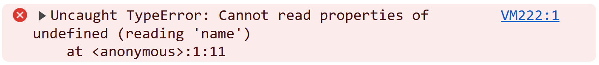
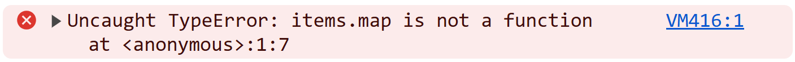

<div style="display:flex; justify-content: center; margin-bottom: 16px;">
  
</div>

<h1 style="color: #fff !important; line-height: 1.1em !important;">Mastering TypeScript</h1>
<h2 style="color: #fff !important; line-height: 1.1em !important;">For Real-World Applications</h2>

_**By Nicolas DUBIEN**_

---
layout: center
---



---
layout: center
---



<!--
  It may feels a bit frustrating whe nusing TypeScript to fall into such problems.
  But in many cases, these cases happen because we are bypassing a bit TypeScript, not defining the right types...
-->

---

## Everyone did it once…

<div style="display: grid; margin-top: 32px; color: white; text-align: center; font-size: 3em; position: relative">
  <v-switch>
    <template #1>
      <div style="grid-row: 1; grid-column: 1">
        <pre style="background-color: rgb(0, 122, 204);"><code>as any</code></pre>
      </div>
    </template>
    <template #2>
      <div style="grid-row: 1; grid-column: 1">
        <pre style="background-color: #cc4700;"><code>as any</code><div style="position: absolute; top: 0; right: 0; height: 0;">😱</div></pre>
      </div>
    </template>
    <template #3>
      <div style="grid-row: 1; grid-column: 1">
        <pre style="background-color: #cc4700;"><code><span style="font-weight: 900;">as</span> <span style="opacity: 50%">any</span></code><div style="position: absolute; top: 0; right: 0; height: 0;">😱</div></pre>
      </div>
    </template>
  </v-switch>
</div>

---

## …not sure?

````md magic-move {lines: true}
```ts
type Props = {}; // should support single-select and multi-select

declare function Select(props: Props);
```

```ts
type Props = {
  multiple: boolean | undefined;
  value: string | string[];
  onChange: (newValue: string | string[]) => void;
};

declare function Select(props: Props);
```

```ts
type Props = {
  /** Should the Select support multi-selection? */
  multiple: boolean | undefined;
  /*
   * Mode multiple=false/undefined: the selected value as a string
   * Mode multiple=true: the selected values as an array of strings
   */
  value: string | string[];
  onChange: (newValue: string | string[]) => void;
};

declare function Select(props: Props);
```

```ts
type Props = {
  /** Should the Select support multi-selection? */
  multiple: boolean | undefined;
  /*
   * Mode multiple=false/undefined: the selected value as a string
   * Mode multiple=true: the selected values as an array of strings
   */
  value: string | string[];
  onChange: (newValue: string | string[]) => void;
};

export default function Select(props: Props) {
  const { multiple, value, onChange } = props;
  return multiple ? (
    <MultipleValuesSelect value={value} onChange={onChange} />
  ) : (
    <SingleValueSelect value={value} onChange={onChange} />
  );
}
```

```ts
type Props = {
  /** Should the Select support multi-selection? */
  multiple: boolean | undefined;
  /*
   * Mode multiple=false/undefined: the selected value as a string
   * Mode multiple=true: the selected values as an array of strings
   */
  value: string | string[];
  onChange: (newValue: string | string[]) => void;
};

export default function Select(props: Props) {
  const { multiple, value, onChange } = props;
  return multiple ? (
    <MultipleValuesSelect value={value as string[]} onChange={onChange} />
  ) : (
    <SingleValueSelect value={value as string} onChange={onChange} />
  );
}
```
````

---
layout: cover
background: https://www.margeride-en-gevaudan.com/wp-content/uploads/2020/01/JSC-PAYSAGES-MARGERIDE-283.jpg
---

<div>
  
</div>

<div style="margin-top: 48px"></div>
<h2 style="color: #fff !important">Mastering TypeScript for Real-World Applications</h2>
<h1 style="color: #fff !important">Nicolas DUBIEN</h1>
<div style="display: flex; justify-content: center; font-size: 1.2em; margin-top: -20px; align-items: end;">
  <span style="margin-top: 0.7em">
    Lead Principal Software Engineer at&nbsp;
  </span>
  
</div>
<div style="opacity: 0.5">
 <a href="https://engineering.pigment.com/" target="_blank">engineering.pigment.com</a>
</div>

<div style="margin-top: 48px"></div>
<div style="display: flex; gap: 8px; color: #ffffff; vertical-align: middle;">
  
  dubzzz
</div>
<div style="display: flex; gap: 8px; color: #ffffff; vertical-align: middle;">
  
  @nicolas.dubien.me
</div>
<div style="display: flex; gap: 8px; color: #ffffff; vertical-align: middle;">
  
  fast-check
</div>

---

<div style="position: absolute; z-index: -1; inset: 0px; background-image: url(/assets/gradient-shape-CHYWUDiD.svg); background-size: cover;"></div>
<div style="position: absolute; z-index: -1; inset: 0px; background-color: rgba(255, 255, 255, 0.1); backdrop-filter: blur(80px);"></div>

<h1 style="color: #0355f3">Our Guiding Example </h1>

<p v-click="1" style="color: #5C4420; opacity: 1">Let’s take an example inspired from <b>Pigment</b>.</p>

<div style="display: grid; margin-top: 16px; color: white; text-align: center;">
  <v-switch>
    <template #2>
      <div style="grid-row: 1; grid-column: 1">
        
      </div>
    </template>
    <template #3>
      <div style="grid-row: 1; grid-column: 1">
        
      </div>
    </template>
    <template #4>
      <div style="grid-row: 1; grid-column: 1">
        
      </div>
    </template>
    <template #5>
<div style="grid-row: 1; grid-column: 1; text-align: left">

```ts
type Props = { x: number, y: number };

function Cell(props: Props) {
  // ...
}
```

</div>
    </template>
    <template #6>
<div style="grid-row: 1; grid-column: 1; text-align: left">

```ts
type Props = { x: number, y: number };

function Cell(props: Props) {
  const { x, y } = props;
  const value = useCellValueAt(x, y);
  // ...
}
```

</div>
    </template>
    <template #7>
<div style="grid-row: 1; grid-column: 1; text-align: left; padding-top: 4px">

```ts twoslash
declare const validX: unique symbol;
type X = number & { [validX]: true };
declare const validY: unique symbol;
type Y = number & { [validY]: true };
declare const x: X;
declare const y: Y;
declare function useCellValueAt(x: X, y: Y): void;
// ---cut-before---
type Props = { x: number, y: number };

function Cell(props: Props) {
  const { x, y } = props;
  const value = useCellValueAt(y, x);
  // ...
}
```

</div>
    </template>
  </v-switch>
</div>

---

# Branded Types

> It's not just a `number`, it's an `X`

<v-click>

````md magic-move {lines: true} 
```ts
export type X = number;
```

```ts
declare const validX: unique symbol;
export type X = number & { [validX]: true };
```

```ts
declare const validX: unique symbol;
export type X = number & { [validX]: true };
export const toX = (x: number) => x as X;
```
````

</v-click>

<v-click>

````md magic-move {lines: true} 
```ts
function useCellValueAt(x: number, y: number): Value {
  // ...
}

type Props = { x: number, y: number };
function Cell(props: Props) {
  const { x, y } = props;
  const value = useCellValueAt(x, y);
  // ...
}
```

```ts
function useCellValueAt(x: X, y: Y): Value {
  // ...
}

type Props = { x: number, y: number };
function Cell(props: Props) {
  const { x, y } = props;
  const value = useCellValueAt(x, y);
  // ...
}
```

```ts
function useCellValueAt(x: X, y: Y): Value {
  // ...
}

type Props = { x: number, y: number };
function Cell(props: Props) {
  const { x, y } = props;
  const value = useCellValueAt(toX(x), toY(y));
  // ...
} 
```
````

</v-click>

---

<div style="position: absolute; z-index: -1; inset: 0px; background-image: url(/assets/gradient-shape-CHYWUDiD.svg); background-size: cover;"></div>
<div style="position: absolute; z-index: -1; inset: 0px; background-color: rgba(255, 255, 255, 0.1); backdrop-filter: blur(80px);"></div>

<h1 style="color: #0355f3">Back to our Guiding Example </h1>

<div style="display: grid; margin-top: 16px; color: white; text-align: center;">
  <v-switch>
    <template #0>
<div style="grid-row: 1; grid-column: 1; text-align: left">

```ts
type Props = { x: number, y: number };

function Cell(props: Props) {
  const { x, y } = props;
  const value = useCellValueAt(toX(x), toY(y));
  // ...
}
```

</div>
    </template>
    <template #1>
<div style="grid-row: 1; grid-column: 1; text-align: left">

```ts
type Props = { x: number, y: number };

type Value = {
  type: 'number' | 'text';
  numberValue?: number;
  textValue?: string;
}

function Cell(props: Props) {
  const { x, y } = props;
  const value = useCellValueAt(toX(x), toY(y));
  // ...
}
```

</div>
    </template>
    <template #2>
<div style="grid-row: 1; grid-column: 1; text-align: left; padding-top: 4px">

```ts twoslash
declare function toX(n: number): number;
declare function toY(n: number): number;
declare function useCellValueAt(x: number, y: number): Value;
declare function renderNumberCell(value: number): null;
declare function renderTextCell(value: string): null;
// ---cut-before---
type Props = { x: number, y: number };

type Value = {
  type: 'number' | 'text';
  numberValue?: number;
  textValue?: string;
}

function Cell(props: Props) {
  const { x, y } = props;
  const value = useCellValueAt(toX(x), toY(y));
  return value.type === 'number'
    ? renderNumberCell(value.numberValue)
    : renderTextCell(value.textValue);
}
```

</div>
    </template>
    <template #3>
<div style="grid-row: 1; grid-column: 1; text-align: left; padding-top: 4px">

```ts twoslash
declare function toX(n: number): number;
declare function toY(n: number): number;
declare function useCellValueAt(x: number, y: number): Value;
declare function renderNumberCell(value: number): null;
declare function renderTextCell(value: string): null;
// ---cut-before---
type Props = { x: number, y: number };

type Value = {
  type: 'number' | 'text';
  numberValue?: number;
  textValue?: string;
}

function Cell(props: Props) {
  const { x, y } = props;
  const value = useCellValueAt(toX(x), toY(y));
  return value.type === 'number'
    ? renderNumberCell(value.numberValue as number)
    : renderTextCell(value.textValue!);
}
```

</div>
    </template>
  </v-switch>
</div>

---

# Discriminated Unions

> Some attributes have to be exclusive to one `type`

<v-click>

````md magic-move {lines: true}
```ts
type Value = {
  type: 'number' | 'text';
  numberValue?: number;
  textValue?: string;
}
```

```ts
type Value =
  | {
      type: 'number';
      numberValue: number;
    }
  | {
      type: 'text';
      textValue: string;
    };
```
````

</v-click>

<v-click>

````md magic-move {lines: true}
```ts
type Props = { x: number, y: number };

function Cell(props: Props) {
  const { x, y } = props;
  const value = useCellValueAt(toX(x), toY(y));
  return value.type === 'number'
    ? renderNumberCell(value.numberValue as number)
    : renderTextCell(value.textValue!);
}
```

```ts
type Props = { x: number, y: number };

function Cell(props: Props) {
  const { x, y } = props;
  const value = useCellValueAt(toX(x), toY(y));
  return value.type === 'number'
    ? renderNumberCell(value.numberValue)
    : renderTextCell(value.textValue);
}
```
````

</v-click>

---

<div style="position: absolute; z-index: -1; inset: 0px; background-image: url(/assets/gradient-shape-CHYWUDiD.svg); background-size: cover;"></div>
<div style="position: absolute; z-index: -1; inset: 0px; background-color: rgba(255, 255, 255, 0.1); backdrop-filter: blur(80px);"></div>

<h1 style="color: #0355f3">Back to our Guiding Example </h1>

<div style="display: grid; margin-top: 16px; color: white; text-align: center;">
  <v-switch>
    <template #0>
<div style="grid-row: 1; grid-column: 1; text-align: left">

```ts
type Props = { x: number, y: number };

function Cell(props: Props) {
  const { x, y } = props;
  const value = useCellValueAt(toX(x), toY(y));
  return value.type === 'number'
    ? renderNumberCell(value.numberValue)
    : renderTextCell(value.textValue);
}
```

</div>
    </template>
    <template #1>
<div style="grid-row: 1; grid-column: 1; text-align: left">

```ts
type Props = { x: number, y: number };

function Cell(props: Props) {
  const { x, y } = props;
  const value = useCellValueAt(toX(x), toY(y));
  if (!isValidValue(value)) {
    return null;
  }
  return value.type === 'number'
    ? renderNumberCell(value.numberValue)
    : renderTextCell(value.textValue);
}
```

</div>
    </template>
    <template #2>
<div style="grid-row: 1; grid-column: 1; text-align: left; padding-top: 4px">

```ts twoslash
declare function toX(n: number): number;
declare function toY(n: number): number;
type ValueFromAPI = {
  type: 'number' | 'text';
  numberValue?: number;
  textValue?: string;
}
declare function useCellValueAt(x: number, y: number): ValueFromAPI;
declare function isValidValue(value: ValueFromAPI): boolean;
declare function renderNumberCell(value: number): null;
declare function renderTextCell(value: string): null;
// ---cut-before---
type Props = { x: number, y: number };

function Cell(props: Props) {
  const { x, y } = props;
  const value = useCellValueAt(toX(x), toY(y));
  if (!isValidValue(value)) {
    return null;
  }
  return value.type === 'number'
    ? renderNumberCell(value.numberValue)
    : renderTextCell(value.textValue);
}
```

</div>
    </template>
  </v-switch>
</div>

---

# Type predicates

> When `isValidValue` returns `true` I expect my value to be safe

<v-click>

````md magic-move {lines: true}
```ts
type ValueFromAPI = {
  type: 'number' | 'text';
  numberValue?: number;
  textValue?: string;
}

type Value =
  | {
      type: 'number';
      numberValue: number;
    }
  | {
      type: 'text';
      textValue: string;
    };

function isValidValue(value: ValueFromAPI): boolean {
  // doing stuff
}
```
```ts
function isValidValue(value: ValueFromAPI): boolean {
  // doing stuff
}
```

```ts
function isValidValue(value: ValueFromAPI): value is Value {
  // doing stuff
}
```
````

</v-click>

---

# Mapped types

> Not fan of copying code, no?

<v-click>

````md magic-move {lines: true}
```ts
type ValueFromAPI = {
  type: 'number' | 'text';
  numberValue?: number;
  textValue?: string;
}
```

```ts
type ValueFromAPI = {
  type: 'number' | 'text';
  numberValue?: number;
  textValue?: string;
}

type Value =
  | {
      type: 'number';
      numberValue: number;
    }
  | {
      type: 'text';
      textValue: string;
    };
```

```ts
type ValueFromAPI = {
  type: 'number' | 'text';
  numberValue?: number;
  textValue?: string;
}

type Value = { [K in ???]: ??? };
```

```ts
type ValueFromAPI = {
  type: 'number' | 'text';
  numberValue?: number;
  textValue?: string;
}

type Value = { [K in ValueFromAPI['type']]: ??? };
// {
//   number: ???,
//   text: ???,
// }
```

```ts
type ValueFromAPI = {
  type: 'number' | 'text';
  numberValue?: number;
  textValue?: string;
}

type Value = { [K in ValueFromAPI['type']]: { type: K } };
// {
//   number: { type: 'number' },
//   text: { type: 'text' },
// }
```

```ts
type ValueFromAPI = {
  type: 'number' | 'text';
  numberValue?: number;
  textValue?: string;
}

type Value = {
  [K in ValueFromAPI['type']]: { type: K }
};
// {
//   number: { type: 'number' },
//   text: { type: 'text' },
// }
```

```ts
type ValueFromAPI = {
  type: 'number' | 'text';
  numberValue?: number;
  textValue?: string;
}

type Value = {
  [K in ValueFromAPI['type']]: { type: K } & Required<Pick<ValueFromAPI, `${K}Value`>>
};
// {
//   number: { type: 'number', numberValue: number },
//   text: { type: 'text', textValue: string },
// }
```

```ts
type ValueFromAPI = {
  type: 'number' | 'text';
  numberValue?: number;
  textValue?: string;
}

type Value = {
  [K in ValueFromAPI['type']]: { type: K } & Required<Pick<ValueFromAPI, `${K}Value`>>
}[ValueFromAPI['type']];
// | { type: 'number', numberValue: number}
// | { type: 'text', textValue: string }
```
````

</v-click>

---

# _\*never_

> Let be future proof

<v-click>

````md magic-move {lines: true}
```ts
return value.type === 'number'
  ? "It's a number"
  : "It's a string"
```

```ts
return value.type === 'number'
  ? "It's a number"
  : value.type === 'text'
  ? "It's a string"
  : "Not supported yet";
```

```ts
return value.type === 'number'
  ? "It's a number"
  : value.type === 'text'
  ? "It's a string"
  : assertUnreachable(value.type, "Not supported yet");
```

```ts
export function assertUnreachable<T>(arg: never, defaultValue: T) {
  return defaultValue;
}

return value.type === 'number'
  ? String(value.numberValue)
  : value.type === 'text'
  ? String(value.textValue);
  : assertUnreachable(value.type, "Not supported yet");
```
````

</v-click>

---

<div style="position: absolute; z-index: -1; inset: 0px; background-image: url(/assets/gradient-shape-CHYWUDiD.svg); background-size: cover;"></div>
<div style="position: absolute; z-index: -1; inset: 0px; background-color: rgba(255, 255, 255, 0.1); backdrop-filter: blur(80px);"></div>

<h1 style="color: #0355f3">Back to our Guiding Example </h1>

<div style="display: grid; margin-top: 16px; color: white; text-align: center;">
  <v-switch>
    <template #0>
<div style="grid-row: 1; grid-column: 1; text-align: left">

```ts
function Cell(props: Props) {
  const { x, y } = props;
  const value = useCellValueAt(toX(x), toY(y));

  if (!isValidValue(value)) {
    return null;
  }

  return value.type === 'number'
    ? renderNumberCell(value.numberValue)
    : renderTextCell(value.textValue);
}
```

</div>
    </template>
    <template #1>
<div style="grid-row: 1; grid-column: 1; text-align: left">

```ts
function Cell(props: Props) {
  const { x, y } = props;
  const value = useCellValueAt(toX(x), toY(y));

  useAlertOnChange((newValue) => {
    alert(`The value at (${x},${y}) changed to ${newValue}`);
  }, value);

  if (!isValidValue(value)) {
    return null;
  }

  return value.type === 'number'
    ? renderNumberCell(value.numberValue)
    : renderTextCell(value.textValue);
}
```

</div>
    </template>
    <template #3>
<div style="grid-row: 1; grid-column: 1; text-align: left">

```ts
type SubscribableValue = Value & {
  subscribe: (onChange: (newValue: Value) => void) => void;
}

function useCellValueAt(x: X, y: Y): SubscribableValue;

function useAlertOnChange(
  onChange: (newValue: Value) => void,
  subscribable: SubscribableValue,
): void;
```

</div>
    </template>
  </v-switch>
</div>

---

# Generic

> Not that re-usable...

<v-click>

````md magic-move {lines: true}
```ts
type SubscribableValue = Value & {
  subscribe: (onChange: (newValue: Value) => void) => void;
}
```

```ts
type Subscribable<T> = T & {
  subscribe: (onChange: (newValue: T) => void) => void;
}
```
````

</v-click>

<v-click>

````md magic-move {lines: true}
```ts
function useAlertOnChange(
  onChange: (newValue: Value) => void,
  subscribable: SubscribableValue,
): void;
```

```ts
function useAlertOnChange<T>(
  onChange: (newValue: T) => void,
  subscribable: Subscribable<T>,
): void;
```
````

</v-click>

---

# Variadics

> Maybe we could support multiple subscribables at once

<v-click>

````md magic-move {lines: true}
```ts
function useAlertOnChange<T>(
  onChange: (newValue: T) => void,
  subscribable: Subscribable<T>,
): void;
```

```ts
function useAlertOnChange<T extends unknown[]>(
  onChange: (...newValues: T) => void,
  ...subscribables: { [K in keyof T]: Subscribable<T[K]> },
): void;
```
````

</v-click>

---

<div style="display: grid; margin-bottom: 48px; gap: 8px; grid-template-columns: repeat(2, minmax(0, 1fr));">
  <div style="grid-row: 1; grid-column: 1">

### Branded Types

```ts
declare const validX: unique symbol;
export type X = number & { [validX]: true };
export const toX = (x: number) => x as X;
```

  </div>
  <div style="grid-row: 1; grid-column: 2">

### Discriminated Unions

```ts
type Value = NumberValue | TextValue;
```

  </div>
  <div style="grid-row: 2; grid-column: 1">

### Type predicates

```ts
function isValidValue(value: ValueFromAPI): boolean {
  // doing stuff
}
```

  </div>
  <div style="grid-row: 2; grid-column: 2">

### Mapped types

```ts
type Value = { [K in Keys]: ValueForK };
```

  </div>
  <div style="grid-row: 3; grid-column: 1">

### \*never

```ts
function assertUnreachable<T>(arg: never, fallback: T) {
  return fallback;
}
```

  </div>
  <div style="grid-row: 3; grid-column: 2">

### Generics & Variadics

```ts
function useAlertOnChange<T extends unknown[]>(
  onChange: (...newValues: T) => void,
  ...subs: { [K in keyof T]: Subscribable<T[K]> },
): void;
```

  </div>
</div>

<h1 style="text-align: right">Questions?</h1>

<p style="text-align: right">Do not hesitate to visit our blog: <a href="https://engineering.pigment.com/" target="_blank">engineering.pigment.com</a></p>
