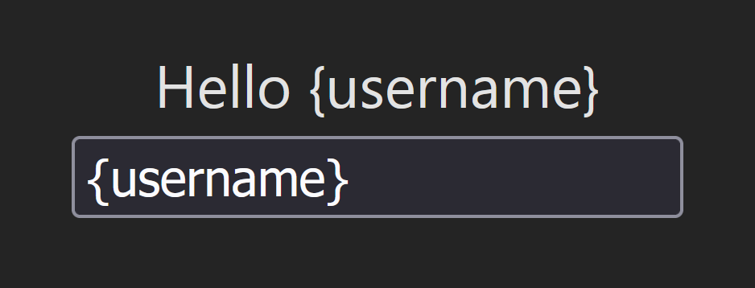

<h1 style="color: #fff !important; line-height: 1.1em !important;">Let's build a toy React</h1>
<h2 style="color: #fff !important; line-height: 0.8em !important; margin-top: -16px; opacity: 0.7"><i>*Highly simplified</i></h2>

_**By Nicolas DUBIEN**_

---
layout: center
---

# Bootstrap

---

<ul>
  <li>Start from React template: <code>npm create vite@latest my-app -- --template react</code></li>
  <li v-click>Replace <code>"react": "*"</code> by <code>"react": "file:../react"</code></li>
  <li v-click>Replace <code>"react-dom": "*"</code> by <code>"react-dom": "file:../react-dom"</code></li>
  <li v-click>Run the dev server: <code>npm run dev</code></li>
  <li v-click>Fix missing files, exports and cie</li>
</ul>

---
layout: center
---

# JSX

---

Target display:



---

````md magic-move {lines: true}
```js
function App() {
  const [value, setValue] = useState("abc");
  return (
    <div>
      <div>
        Hello <span>{value || <i>Enter your name</i>}</span>
      </div>
      <input
        value={value}
        placeholder="Your name"
        onKeyDown={(event) => setValue(event.target.value + event.key)}
      />
    </div>
  );
}
```

```js
<div>
  <div>
    Hello <span><i>Enter your name</i></span>
  </div>
  <input
    value=""
    placeholder="Your name"
    onKeyDown={(event) => console.log(event)}
  />
</div>
```

```js
<div>
  <div>Hello</div>
  <input value="" />
</div>
```

```js
jsx('div', {
  children: [
    jsx('div', { children: 'Hello' }),
    jsx('input', { value: '' }),
  ]
})
```

```json
{
  type: "div",
  props: {
    children: [
      {
        type: "div",
        props: { children: "Hello" },
      },
      {
        type: "input",
        props: { value: "" },
      },
    ]
  },
}
```
````

---

Our own JSX builder:

```js
export const jsxDEV = (type, props) => {
  return { type, props };
};
```

_To be defined in `react`_

---
layout: center
---

# Creating the root

---


---

```js
createRoot(document.getElementById("root")).render(<jsx />)
```

---

````md magic-move {lines: true}
```js
export const createRoot = () => {
  return {
    render: (component) => {
      // Not implemented yet!
    },
  };
};
```

```js
// @ts-check

/**
 * @typedef {{ type: string; props: object }} JSX
 */

/**
 * @param {HTMLElement} rootElement
 */
export const createRoot = (rootElement) => {
  return {
    /**
     * @param {JSX} component
     */
    render: (component) => {
      // Not implemented yet!
    },
  };
};
```

```js
// @ts-check

/**
 * @typedef {{ type: string; props: object }} JSX
 */

/**
 * @param {HTMLElement} parentElement
 * @param {JSX} component
 */
function render(parentElement, component) {
  // Not implemented yet!
}

/**
 * @param {HTMLElement} rootElement
 */
export const createRoot = (rootElement) => {
  return {
    /**
     * @param {JSX} component
     */
    render: (component) => {
      render(rootElement, component);
    },
  };
};
```

```js
/**
 * @param {HTMLElement} parentElement
 * @param {JSX} component
 */
function render(parentElement, component) {
  // Not implemented yet!
}
```

```js
/**
 * @param {HTMLElement} parentElement
 * @param {JSX} component
 */
function render(parentElement, component) {
  const element = document.createElement(component.type);
  const children = Array.isArray(component.props.children)
    ? component.props.children
    : component.props.children != null
    ? [component.props.children]
    : [];
  for (const child of children) {
    render(element, child);
  }
  parentElement.appendChild(element);
}
```

```js
/**
 * @param {HTMLElement} parentElement
 * @param {JSX} component
 */
function render(parentElement, component) {
  if (component.type == "text") {
    const element = document.createTextNode(component.props.children);
    parentElement.appendChild(element);
    return;
  }
  const element = document.createElement(component.type);
  const children = Array.isArray(component.props.children)
    ? component.props.children
    : component.props.children != null
    ? [component.props.children]
    : [];
  for (const child of children) {
    const revampedChild =
      typeof child === "string"
        ? { type: "text", props: { children: [child] } }
        : child;
    render(element, child);
  }
  parentElement.appendChild(element);
}
```
````

_To be defined in `react-dom`_

---
layout: center
---

# Commit phase

---

````md magic-move {lines: true}
```js
export const createRoot = (rootElement) => {
  return {
    /**
     * @param {JSX} component
     */
    render: (component) => {
      render(rootElement, component);
    },
  };
};
```

```js
export const createRoot = (rootElement) => {
  return {
    /**
     * @param {JSX} component
     */
    render: (component) => {
      traverse(component); // building a parallel DOM
      commit(component);   // commiting the changes on the real DOM
    },
  };
};
```

```js
/** @typedef {JSX & { children?: Fiber[]; parent?: Fiber; dom?: HTMLElement }} Fiber */

export const createRoot = (rootElement) => {
  return {
    /**
     * @param {JSX} component
     */
    render: (component) => {
      traverse(component);
      commit(component);
    },
  };
};
```

```js
/** @typedef {JSX & { children?: Fiber[]; parent?: Fiber; dom?: HTMLElement }} Fiber */

export const createRoot = (rootElement) => {
  return {
    /**
     * @param {JSX} component
     */
    render: (component) => {
      /** @type {Fiber} */
      const rootFiber = {
        type: 'root',
        props: { children: [component] },
        children: [component],
        dom: rootElement,
      }
      traverse(rootFiber);
      commit(rootFiber.children[0]);
    },
  };
};
```

```js
/** @typedef {JSX & { children?: Fiber[]; parent?: Fiber; dom?: HTMLElement }} Fiber */

/**
 * @param {HTMLElement} parentElement
 * @param {JSX} component
 */
function render(parentElement, component) {
  if (component.type == "text") {
    const element = document.createTextNode(component.props.children);
    parentElement.appendChild(element);
    return;
  }
  const element = document.createElement(component.type);
  const children = Array.isArray(component.props.children)
    ? component.props.children
    : component.props.children != null
    ? [component.props.children]
    : [];
  for (const child of children) {
    const revampedChild =
      typeof child === "string"
        ? { type: "text", props: { children: [child] } }
        : child;
    render(element, revampedChild);
  }
  parentElement.appendChild(element);
}
```

```js
/** @typedef {JSX & { children?: Fiber[]; parent?: Fiber; dom?: HTMLElement }} Fiber */

/**
 * @param {Fiber} fiber
 */
function traverse(fiber) {
  if (fiber.type == "text") {
    const element = document.createTextNode(fiber.props.children);
    parentElement.appendChild(element);
    return;
  }
  const element = document.createElement(fiber.type);
  const children = Array.isArray(fiber.props.children)
    ? fiber.props.children
    : fiber.props.children != null
    ? [fiber.props.children]
    : [];
  for (const child of children) {
    const revampedChild =
      typeof child === "string"
        ? { type: "text", props: { children: [child] } }
        : child;
    render(element, revampedChild); // to be replaced!
  }
  parentElement.appendChild(element);
}
```

```js
/** @typedef {JSX & { children?: Fiber[]; parent?: Fiber; dom?: HTMLElement }} Fiber */

/**
 * @param {Fiber} fiber
 */
function traverse(fiber) {
  const children = Array.isArray(fiber.props.children)
    ? fiber.props.children
    : fiber.props.children != null
    ? [fiber.props.children]
    : [];
  for (const child of children) {
    const revampedChild =
      typeof child === "string"
        ? { type: "text", props: { children: [child] } }
        : child;
    render(element, revampedChild); // to be replaced!
  }
}
```

```js
/** @typedef {JSX & { children?: Fiber[]; parent?: Fiber; dom?: HTMLElement }} Fiber */

/**
 * @param {Fiber} fiber
 */
function traverse(fiber) {
  fiber.children = Array.isArray(fiber.props.children)
    ? fiber.props.children
    : fiber.props.children != null
    ? [fiber.props.children]
    : [];
  for (const child of fiber.children) {
    const revampedChild =
      typeof child === "string"
        ? { type: "text", props: { children: [child] } }
        : child;
    render(element, revampedChild); // to be replaced!
  }
}
```

```js
/** @typedef {JSX & { children?: Fiber[]; parent?: Fiber; dom?: HTMLElement }} Fiber */

/**
 * @param {Fiber} fiber
 */
function traverse(fiber) {
  fiber.children = Array.isArray(fiber.props.children)
    ? fiber.props.children
    : fiber.props.children != null
    ? [fiber.props.children]
    : [];
  for (let index = 0; index !== fiber.children.length; ++index) {
    const child = fiber.children[index];
    if (typeof child === "string") {
      fiber.children[index] = {
        type: "text",
        props: {},
        children: [],
        parent: fiber,
        dom: undefined,
      };
    }
  }
  for (const child of fiber.children) {
    render(element, child); // to be replaced!
  }
}
```

```js
/** @typedef {JSX & { children?: Fiber[]; parent?: Fiber; dom?: HTMLElement; textContent?: string }} Fiber */

/**
 * @param {Fiber} fiber
 */
function traverse(fiber) {
  fiber.children = Array.isArray(fiber.props.children)
    ? fiber.props.children
    : fiber.props.children != null
    ? [fiber.props.children]
    : [];
  for (let index = 0; index !== fiber.children.length; ++index) {
    const child = fiber.children[index];
    if (typeof child === "string") {
      fiber.children[index] = {
        type: "text",
        props: {},
        children: [],
        parent: fiber,
        dom: undefined,
        content: child
      };
    }
  }
  for (const child of fiber.children) {
    render(element, child); // to be replaced!
  }
}
```

```js
/** @typedef {JSX & { children?: Fiber[]; parent?: Fiber; dom?: HTMLElement; textContent?: string }} Fiber */

/**
 * @param {Fiber} fiber
 */
function traverse(fiber) {
  fiber.children = Array.isArray(fiber.props.children)
    ? fiber.props.children
    : fiber.props.children != null
    ? [fiber.props.children]
    : [];
  for (let index = 0; index !== fiber.children.length; ++index) {
    const child = fiber.children[index];
    if (typeof child === "string") {
      fiber.children[index] = {
        type: "text",
        props: {},
        children: [],
        parent: fiber,
        dom: undefined,
        content: child
      };
    }
  }
  for (const child of fiber.children) {
    child.parent = fiber;
    traverse(child);
  }
}
```

```js
/** @typedef {JSX & { children?: Fiber[]; parent?: Fiber; dom?: HTMLElement; textContent?: string }} Fiber */

/**
 * @param {Fiber} fiber
 */
function commit(fiber) {
  // Not implemented yet!
}
```

```js
/** @typedef {JSX & { children?: Fiber[]; parent?: Fiber; dom?: HTMLElement; textContent?: string }} Fiber */

/**
 * @param {Fiber} fiber
 */
function commit(fiber) {
  if (!fiber.dom) {
    fiber.dom =
      fiber.type === "text"
        ? document.createTextNode(fiber.content)
        : document.createElement(fiber.type);
  }
}
```

```js
/** @typedef {JSX & { children?: Fiber[]; parent?: Fiber; dom?: HTMLElement; textContent?: string }} Fiber */

/**
 * @param {Fiber} fiber
 */
function commit(fiber) {
  const parentDom = fiber.parent.dom;
  if (!fiber.dom) {
    fiber.dom =
      fiber.type === "text"
        ? document.createTextNode(fiber.content)
        : document.createElement(fiber.type);
  }
  parentDom.appendChild(fiber.dom);
}
```

```js
/** @typedef {JSX & { children?: Fiber[]; parent?: Fiber; dom?: HTMLElement; textContent?: string }} Fiber */

/**
 * @param {Fiber} fiber
 */
function commit(fiber) {
  const parentDom = fiber.parent.dom;
  if (!fiber.dom) {
    fiber.dom =
      fiber.type === "text"
        ? document.createTextNode(fiber.content)
        : document.createElement(fiber.type);
  }
  parentDom.appendChild(fiber.dom);
  for (const child of fiber.children) {
    commit(child);
  }
}
```
````

---
layout: center
---

# Styling

---

````md magic-move {lines: true}
```js
/**
 * @param {Fiber} fiber
 */
function commit(fiber) {
  const parentDom = fiber.parent.dom;
  if (!fiber.dom) {
    fiber.dom =
      fiber.type === "text"
        ? document.createTextNode(fiber.content)
        : document.createElement(fiber.type);
  }
  parentDom.appendChild(fiber.dom);
  for (const child of fiber.children) {
    commit(child);
  }
}
```

```js
/**
 * @param {HTMLElement} node
 * @param {object} props
 */
function updateDom(node, props) {
  // Not implemented yet!
}

/**
 * @param {Fiber} fiber
 */
function commit(fiber) {
  const parentDom = fiber.parent.dom;
  if (!fiber.dom) {
    fiber.dom =
      fiber.type === "text"
        ? document.createTextNode(fiber.content)
        : document.createElement(fiber.type);
  }
  updateDom(fiber.dom, fiber.props);
  parentDom.appendChild(fiber.dom);
  for (const child of fiber.children) {
    commit(child);
  }
}
```

```js
/**
 * @param {HTMLElement} node
 * @param {object} props
 */
function updateDom(node, props) {
  for (const [key, value] of Object.entries(props)) {
    node.setAttribute(key, String(value));
  }
} 
```

```js
/**
 * @param {HTMLElement} node
 * @param {object} props
 */
function updateDom(node, props) {
  for (const [key, value] of Object.entries(props)) {
    if (key.startsWith("on")) {
      node.addEventListener(key.substring(2).toLocaleLowerCase(), value);
    } else if (key !== "children") {
      node.setAttribute(key, String(value));
    }
  }
} 
```
````

---
layout: center
---

# Function components

---

````md magic-move {lines: true}
```js
createRoot(document.getElementById("root")).render(
  <div>
    <div>
      Hello{" "}
      <span>
        <i>Enter your name</i>
      </span>
    </div>
    <input
      value=""
      placeholder="Your name"
      onKeyDown={(event) => console.log(event)}
    />
  </div>
);
```

```js
function App() {
  return (
    <div>
      <div>
        Hello{" "}
        <span>
          <i>Enter your name</i>
        </span>
      </div>
      <input
        value=""
        placeholder="Your name"
        onKeyDown={(event) => console.log(event)}
      />
    </div>
  );
}

createRoot(document.getElementById("root")).render(<App />);
```

```js
/**
 * @typedef {{ type: string; props: object }} JSX
 */
```

```js
/**
 * @typedef {{ type: string | ((props: any) => JSX); props: object }} JSX
 */
```

```js
/**
 * @param {Fiber} fiber
 */
function traverse(fiber) {
  // FIXME!
}

/**
 * @param {Fiber} fiber
 */
function commit(fiber) {
  // FIXME!
}
```

```js
/**
 * @param {Fiber} fiber
 */
function traverse(fiber) {
  fiber.children = Array.isArray(fiber.props.children)
    ? fiber.props.children
    : fiber.props.children != null
    ? [fiber.props.children]
    : [];
  for (let index = 0; index !== fiber.children.length; ++index) {
    const child = fiber.children[index];
    if (typeof child === "string") {
      fiber.children[index] = {
        type: "text",
        props: {},
        children: [],
        parent: fiber,
        dom: undefined,
        content: child,
      };
    }
  }
  for (const child of fiber.children) {
    child.parent = fiber;
    traverse(child);
  }
}
```

```js
/**
 * @param {Fiber} fiber
 */
function traverse(fiber) {
  fiber.children = Array.isArray(fiber.props.children)
    ? fiber.props.children
    : fiber.props.children != null
    ? [fiber.props.children]
    : [];
  reconcile(fiber);
}
```

```js
/**
 * @param {Fiber} fiber
 */
function traverse(fiber) {
  if (typeof fiber.type === "string") {
    fiber.children = Array.isArray(fiber.props.children)
      ? fiber.props.children
      : fiber.props.children != null
      ? [fiber.props.children]
      : [];
    reconcile(fiber);
  }
}
```

```js
/**
 * @param {Fiber} fiber
 */
function traverse(fiber) {
  if (typeof fiber.type === "function") {
    return;
  }
  if (typeof fiber.type === "string") {
    fiber.children = Array.isArray(fiber.props.children)
      ? fiber.props.children
      : fiber.props.children != null
      ? [fiber.props.children]
      : [];
    reconcile(fiber);
  }
  return;
}
```

```js
/**
 * @param {Fiber} fiber
 */
function traverse(fiber) {
  if (typeof fiber.type === "function") {
    return;
  }
  if (typeof fiber.type === "string") {
    fiber.children = Array.isArray(fiber.props.children)
      ? fiber.props.children
      : fiber.props.children != null
      ? [fiber.props.children]
      : [];
    reconcile(fiber);
  }
  return;
}
```

```js
/**
 * @param {Fiber} fiber
 */
function commit(fiber) {
  const parentDom = fiber.parent.dom;
  if (!fiber.dom) {
    fiber.dom =
      fiber.type === "text"
        ? document.createTextNode(fiber.content)
        : document.createElement(fiber.type);
  }
  updateDom(fiber.dom, fiber.props);
  parentDom.appendChild(fiber.dom);
  for (const child of fiber.children) {
    commit(child);
  }
}
```

```js
/**
 * @param {Fiber} fiber
 */
function commit(fiber) {
  const parentDom = fiber.parent.dom;
  if (!fiber.dom && typeof fiber.type === "string") {
    fiber.dom =
      fiber.type === "text"
        ? document.createTextNode(fiber.content)
        : document.createElement(fiber.type);
  }
  if (fiber.dom) {
    updateDom(fiber.dom, fiber.props);
    parentDom.appendChild(fiber.dom);
  }
  for (const child of fiber.children) {
    commit(child);
  }
}
```

```js
/**
 * @param {Fiber} fiber
 */
function closestParentDom(fiber) {
  // Not implemented yet!
}

/**
 * @param {Fiber} fiber
 */
function commit(fiber) {
  const parentDom = closestParentDom(fiber);
  if (!fiber.dom && typeof fiber.type === "string") {
    fiber.dom =
      fiber.type === "text"
        ? document.createTextNode(fiber.content)
        : document.createElement(fiber.type);
  }
  if (fiber.dom) {
    updateDom(fiber.dom, fiber.props);
    parentDom.appendChild(fiber.dom);
  }
  for (const child of fiber.children) {
    commit(child);
  }
}
```

```js
/**
 * @param {Fiber} fiber
 */
function closestParentDom(fiber) {
  let current = fiber.parent;
  while (!current.dom) {
    current = current.parent;
  }
  return current.dom;
}

/**
 * @param {Fiber} fiber
 */
function commit(fiber) {
  const parentDom = closestParentDom(fiber);
  if (!fiber.dom && typeof fiber.type === "string") {
    fiber.dom =
      fiber.type === "text"
        ? document.createTextNode(fiber.content)
        : document.createElement(fiber.type);
  }
  if (fiber.dom) {
    updateDom(fiber.dom, fiber.props);
    parentDom.appendChild(fiber.dom);
  }
  for (const child of fiber.children) {
    commit(child);
  }
}
```
````

---
layout: center
---

# State?

---
layout: center
---

Honestly who care? Static website are great!

---
layout: center
---

# Reconciliation

---

````md magic-move {lines: true}
```js
/** @typedef {JSX & { children?: Fiber[]; parent?: Fiber; dom?: HTMLElement; textContent?: string }} Fiber */
```

```js
/** @typedef {JSX & { children?: Fiber[]; parent?: Fiber; dom?: HTMLElement; textContent?: string; prevProps?: object }} Fiber */
```

```js
/**
 * @param {Fiber} fiber
 */
function commit(fiber) {
  const parentDom = closestParentDom(fiber);
  if (!fiber.dom && typeof fiber.type === "string") {
    fiber.dom =
      fiber.type === "text"
        ? document.createTextNode(fiber.content)
        : document.createElement(fiber.type);
  }
  if (fiber.dom) {
    updateDom(fiber.dom, fiber.props);
    parentDom.appendChild(fiber.dom);
  }
  for (const child of fiber.children) {
    commit(child);
  }
}
```

```js
/**
 * @param {Fiber} fiber
 */
function commit(fiber) {
  const parentDom = closestParentDom(fiber);
  if (!fiber.dom && typeof fiber.type === "string") {
    fiber.dom =
      fiber.type === "text"
        ? document.createTextNode(fiber.content)
        : document.createElement(fiber.type);
  }
  if (fiber.dom) {
    updateDom(fiber.dom, fiber.prevProps || {}, fiber.props);
    parentDom.appendChild(fiber.dom);
  }
  for (const child of fiber.children) {
    commit(child);
  }
}
```

```js
/**
 * @param {Fiber} fiber
 */
function traverse(fiber) {
  if (typeof fiber.type === "function") {
    fiber.children = [fiber.type(fiber.props)];
    reconcile(fiber);
    return;
  }
  if (typeof fiber.type === "string") {
    fiber.children = Array.isArray(fiber.props.children)
      ? fiber.props.children
      : fiber.props.children != null
      ? [fiber.props.children]
      : [];
    reconcile(fiber);
  }
}
```

```js
/**
 * @param {Fiber} fiber
 */
function traverse(fiber) {
  if (typeof fiber.type === "function") {
    const prevChildren = fiber.children;
    fiber.children = [fiber.type(fiber.props)];
    reconcile(fiber, prevChildren);
    return;
  }
  if (typeof fiber.type === "string") {
    const prevChildren = fiber.children;
    fiber.children = Array.isArray(fiber.props.children)
      ? fiber.props.children
      : fiber.props.children != null
      ? [fiber.props.children]
      : [];
    reconcile(fiber, prevChildren);
  }
}
```

```js
/**
 * @param {Fiber} fiber
 * @param {Fiber[]|undefined} prevChildren
 */
function reconcile(fiber, prevChildren) {
  sanitize(fiber);
  for (
    let index = 0;
    index !== Math.max(fiber.children.length, (prevChildren || []).length);
    ++index
  ) {
    const child = fiber.children[index];
    const prevChild = prevChildren && prevChildren[index];
    if (child?.type !== prevChild?.type) {
      if (child) {
        child.parent = fiber;
        traverse(child);
      } else {
        // TODO: handle deletions
      }
    } else {
      fiber.children[index] = prevChild;
      prevChild.parent = fiber;
      prevChild.prevProps = prevChild.props;
      prevChild.props = child.props;
      prevChild.content = child.content;
      traverse(prevChild);
    }
  }
}
```

```js
/**
 * @param {Fiber} fiber
 * @param {Fiber[]|undefined} prevChildren
 */
function reconcile(fiber, prevChildren) {
  sanitize(fiber);
  for (
    let index = 0;
    index !== Math.max(fiber.children.length, (prevChildren || []).length);
    ++index
  ) {
    const child = fiber.children[index];
    const prevChild = prevChildren && prevChildren[index];
    if (child?.type !== prevChild?.type) {
      if (child) {
        child.parent = fiber;
        traverse(child);
      } else {
        deletions.push(prevChild);
      }
    } else {
      fiber.children[index] = prevChild;
      prevChild.parent = fiber;
      prevChild.prevProps = prevChild.props;
      prevChild.props = child.props;
      prevChild.content = child.content;
      traverse(prevChild);
    }
  }
}
```

```js
/**
 * @param {Fiber} fiber
 */
function commitDeletion(fiber) {
  // Not implemented yet!
}

export const createRoot = (rootElement) => {
  return {
    /**
     * @param {JSX} component
     */
    render: (component) => {
      /** @type {Fiber} */
      const rootFiber = {
        type: "root",
        props: { children: [component] },
        children: [component],
        dom: rootElement,
      };
      traverse(rootFiber);
      deletions.forEach(commitDeletion);
      deletions.splice(0, deletions.length);
      commit(rootFiber.children[0]);
    },
  };
};
```

```js
/**
 * @param {Fiber} fiber
 */
function commitDeletion(fiber) {
  const parentDom = closestParentDom(fiber);
  if (fiber.dom) {
    parentDom.appendChild(fiber.dom);
  }
  let current = fiber;
  while (!fiber.dom) {
    current = fiber.children[0];
  }
  parentDom.removeChild(current.dom);
}

export const createRoot = (rootElement) => {
  return {
    /**
     * @param {JSX} component
     */
    render: (component) => {
      /** @type {Fiber} */
      const rootFiber = {
        type: "root",
        props: { children: [component] },
        children: [component],
        dom: rootElement,
      };
      traverse(rootFiber);
      deletions.forEach(commitDeletion);
      deletions.splice(0, deletions.length);
      commit(rootFiber.children[0]);
    },
  };
};
```
````

---
layout: center
---

# State

---

````md magic-move {lines: true}
```js
function App() {
  return (
    <div>
      <div>
        Hello <span><i>Enter your name</i></span>
      </div>
      <input
        value=""
        placeholder="Your name"
        onKeyDown={(event) => console.log(event)}
      />
    </div>
  );
}
```

```js
function App() {
  const [value, setValue] = useState("");
  return (
    <div>
      <div>
        Hello <span>{value || <i>Enter your name</i>}</span>
      </div>
      <input
        value={value}
        placeholder="Your name"
        onKeyDown={(event) => setValue(event.target.value + event.key)}
      />
    </div>
  );
}
```
````