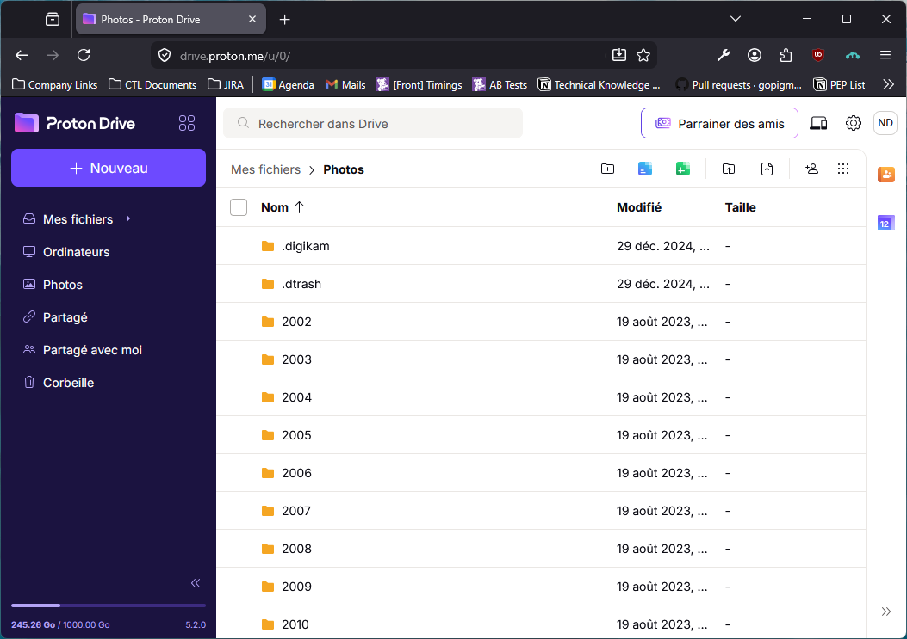
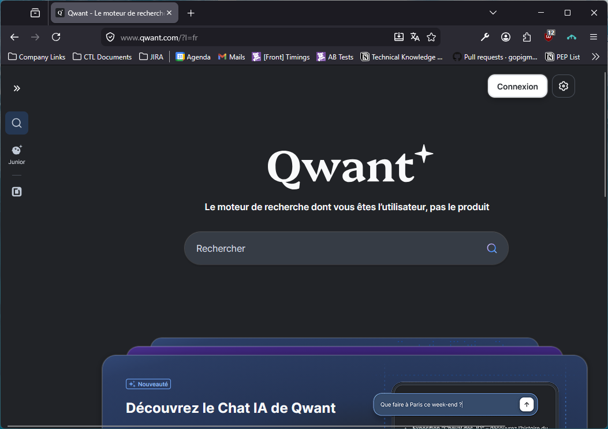
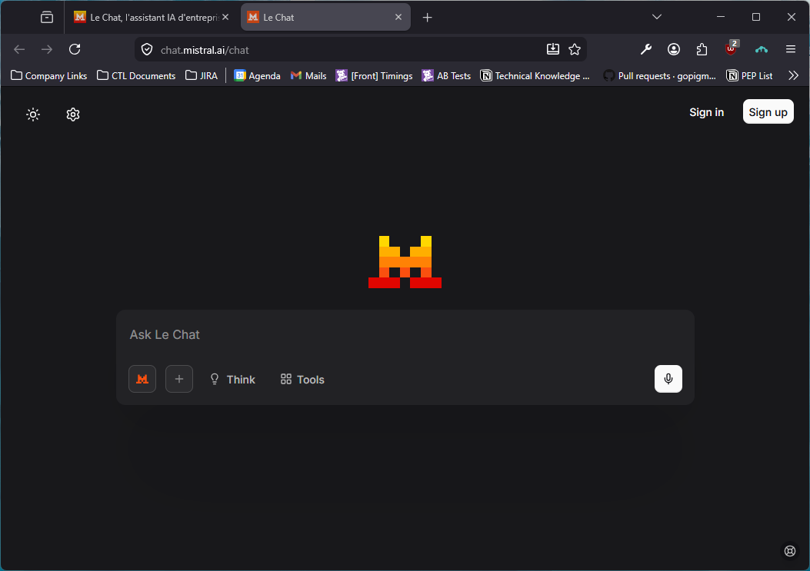
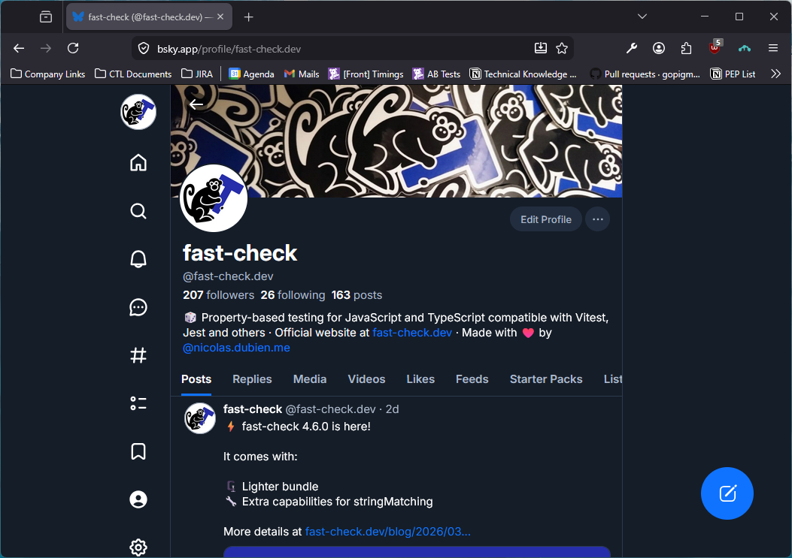
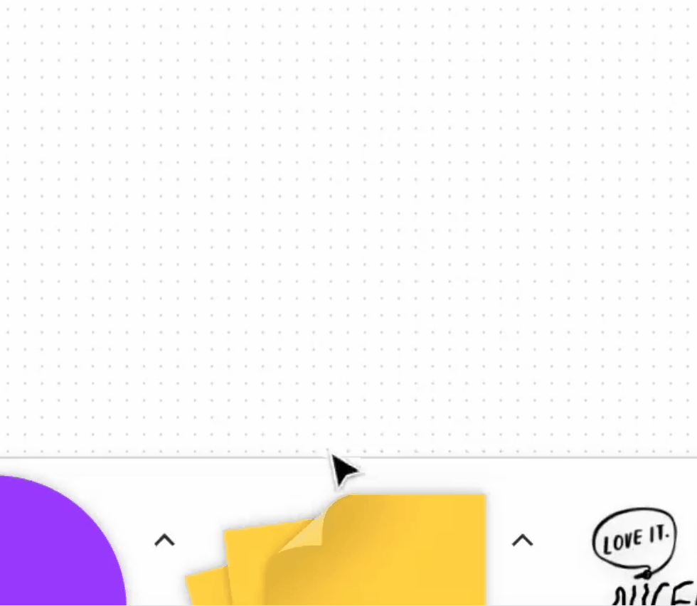
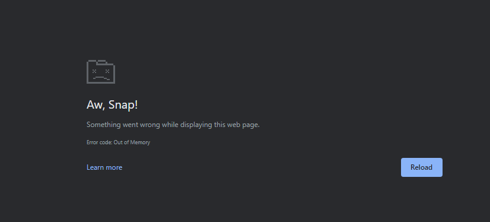
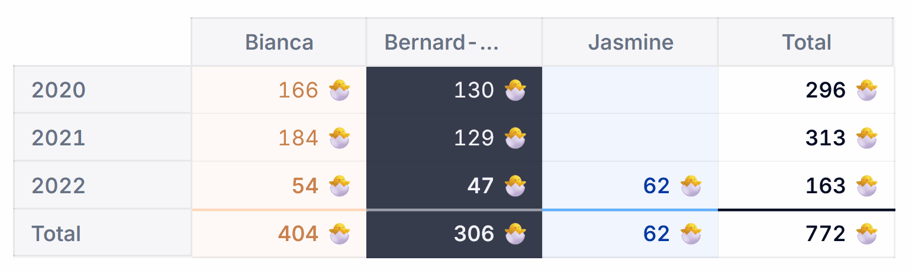
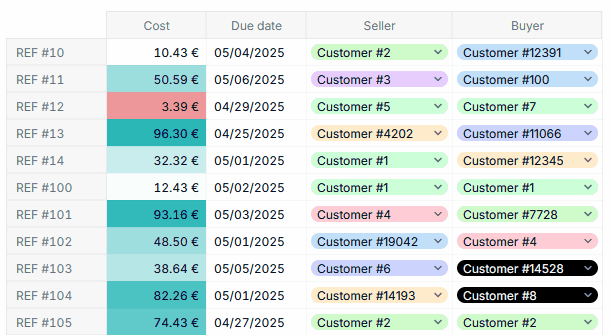

<div style="display:flex; justify-content: center; margin-bottom: 16px;">
  
</div>

<h1 style="color: #fff !important; line-height: 1.1em !important;">Chasing Performance Drifts</h1>
<h2 style="color: #fff !important; line-height: 1.1em !important;">A few recipes that scaled 🧑‍🍳</h2>

<p style="color: #002355; filter: drop-shadow(0 0 8px rgba(255,255,255,0.6))">By Nicolas DUBIEN</p>

---

<h1>Performance matters</h1>

<div v-click="1" class="quote-card">
  <div class="quote-author">Marissa Mayer, then Google VP, in 2006</div>
  <blockquote>A 500ms delay in search results caused a <b>20% drop in traffic</b></blockquote>
  <div class="quote-source">
    <a href="https://glinden.blogspot.com/2006/11/marissa-mayer-at-web-20.html" target="_blank" rel="noopener noreferrer">glinden.blogspot.com</a>
  </div>
</div>

<div v-click="2" class="quote-card">
  <div class="quote-author">Greg Linden, former Amazon engineer, in 2006</div>
  <blockquote>A 100ms increase in page load time caused a <b>1% drop in sales</b></blockquote>
  <div class="quote-source">
    <a href="https://assets.website-files.com/61060433cb5cbb34f58da08c/61065835a1cb346f7673c592_StanfordDataMiningAmazonCaseStudy.pdf" target="_blank" rel="noopener noreferrer">Stanford Data Mining Case Study</a>
  </div>
</div>

<div v-click="3" class="quote-card">
  <div class="quote-author">Ko-Hsin Liang — 500-repo static analysis study, Feb 2026</div>
  <blockquote><b>86% of repositories</b> have at least one missing-cleanup pattern — each leaking ~8 KB per navigation cycle, compounding silently in production</blockquote>
  <div class="quote-source">
    <a href="https://stackinsight.dev/blog/memory-leak-empirical-study/" target="_blank" rel="noopener noreferrer">stackinsight.dev</a>
  </div>
</div>

<!--
  Before we dig on chasing them, let's try to understand why we should care about performance!
  So first thing: it matters! Second one: it matters even for UI!

  And one of the best way to justify that is to take two studies that have been done in the past.

  One reported by Marissa Mayer then Google VP in 2006:
  > increasing by 500ms the time it takes to perform a search on Google, dropped the traffic by 20%

  Another by Greg Linden (former Amazon engineer):
  > increasing the page load of Amazon by 100ms reduced sales by 1%

  Both going in the same direction: performance matters, if you get too slow to compute, retrieve and then show the data your users may churn.

  And now a more recent one — a 2026 study scanning 500 public repos (including Next.js, Kibana, AFFiNE):
  > 86% had at least one missing cleanup: a useEffect without a return, a subscribe() without unsubscribe(), a setInterval without clearInterval.
  > Each one invisible in dev. Each one leaking ~8 KB per navigation cycle in production.
  > The heap climbs 200 MB, 300 MB, 400 MB — with no sign of leveling off.
  This is the other face of performance: not a sudden spike, but a slow, silent drift.
  That's exactly what this talk is about.

  https://assets.website-files.com/61060433cb5cbb34f58da08c/61065835a1cb346f7673c592_StanfordDataMiningAmazonCaseStudy.pdf
  >  +500 ms -20% traffic @ Google
  >  +100 ms -1% sales @ Amazon
  >  Speed matters!
  By Greg Linden (former Amazon engineer)
  https://glinden.blogspot.com/2006/11/marissa-mayer-at-web-20.html
  >  So, Marissa ran an experiment where Google increased the number of search results to thirty. Traffic and revenue from Google searchers in the experimental group dropped by 20%.
  >  Half a second delay caused a 20% drop in traffic. Half a second delay killed user satisfaction.
  By Marissa Mayer then Google VP
  https://www.conductor.com/academy/page-speed-resources/faq/amazon-page-speed-study/
  https://www.gigaspaces.com/blog/amazon-found-every-100ms-of-latency-cost-them-1-in-sales
-->

---

<h2>Even more for UI</h2>

<div style="display: grid; margin-top: 16px; color: white; text-align: center; gap: 16px; grid-template-rows: repeat(2, 1fr); grid-template-columns: repeat(2, 1fr); height: calc(100% - 60px); overflow: hidden;">
  <div style="grid-row: 1; grid-column: 1; overflow: hidden; min-height: 0;">
    
  </div>
  <div style="grid-row: 1; grid-column: 2; overflow: hidden; min-height: 0;">
    
  </div>
  <div style="grid-row: 2; grid-column: 1; overflow: hidden; min-height: 0;">
    
  </div>
  <div style="grid-row: 2; grid-column: 2; overflow: hidden; min-height: 0;">
    
  </div>
</div>

---

<div :class="{ 'old-bg': true, 'hide-bg': $clicks < 1 }"></div>

<h2 :class="{ 'old-times': $clicks >= 1 }">But performance is fragile…</h2>

<p v-click="1" class="old-times">Back in 2023, Figma's FigJam team shipped a new sticky note animation…</p>



<p v-click="3" class="old-times" style="background: rgba(255,255,255,0.3); border-radius: 10px; padding: 10px 16px; margin-top: 12px;">
  Frame duration jumped from <strong>28ms → 80ms</strong> — a <strong>3× slowdown</strong> across the entire canvas.
  <br/>
  Caused by a single CSS line found on Stack Overflow: <code style="background: rgba(0,0,0,0.08); padding: 2px 6px; border-radius: 4px;">backdrop-filter: blur(0)</code> propagating GPU layers everywhere.
  <br/>
  <a href="https://x.com/finerflame/status/1636163183898673152" style="font-size: 0.8em; opacity: 0.6">x.com/finerflame/status/1636163183898673152</a>
</p>

---
layout: cover
background: https://www.margeride-en-gevaudan.com/wp-content/uploads/2020/01/JSC-PAYSAGES-MARGERIDE-283.jpg
---

<div>
  
</div>

<div style="margin-top: 48px"></div>
<h1 style="color: #fff !important">Chasing Performance Drifts</h1>
<h2 style="color: #fff !important; margin-top: 24px; opacity: 0.9">Nicolas DUBIEN</h2>
<div style="display: flex; justify-content: center; font-size: 1.2em; margin-top: -12px; align-items: end; opacity: 0.9">
  <span style="margin-top: 0.7em">
    Lead Principal Software Engineer at&nbsp;
  </span>
  
</div>

<div style="margin-top: 24px"></div>
<div style="display: flex; gap: 8px; color: #ffffff; vertical-align: middle; opacity: 0.9">
  
  dubzzz
</div>
<div style="display: flex; gap: 8px; color: #ffffff; vertical-align: middle; opacity: 0.9">
  
  @nicolas.dubien.me
</div>
<div style="display: flex; gap: 8px; color: #ffffff; vertical-align: middle; opacity: 0.9">
  
  fast-check
</div>

---

<div :class="{ 'pigment-bg-1': true }"></div>
<div :class="{ 'pigment-bg-2': true }"></div>

<h1 style="color: #0355f3">Our "fil rouge"<span v-click="4">: The Board</span> </h1>

<p v-click="1" style="color: #5C4420; opacity: 1">Let's rebuild, one after the other, the performance safety nets we built at <b>Pigment</b>.</p>

<div style="display: grid; margin-top: 16px; color: white; text-align: center;">
  <v-switch>
    <template #2>
      <div style="grid-row: 1; grid-column: 1">
        
      </div>
    </template>
    <template #3>
      <div style="grid-row: 1; grid-column: 1">
        
      </div>
    </template>
    <template #4>
      <div style="grid-row: 1; grid-column: 1">
        
      </div>
    </template>
  </v-switch>
</div>

---

<div :class="{ 'old-bg': true, 'hide-bg': $clicks < 1 }"></div>
<div :class="{ 'pigment-bg-1': true, 'hide-bg': $clicks >= 1 }"></div>
<div :class="{ 'pigment-bg-2': true, 'hide-bg': $clicks >= 1 }"></div>

<h1 :class="{ 'old-times': $clicks >= 1 }">The first crack</h1>

<div v-click="1" class="chat-bubble old">
  <div class="chat-avatar">👤</div>
  <div class="chat-msg">Our tabs keep crashing</div>
</div>
<div v-click="2" class="chat-bubble old">
  <div class="chat-avatar">👤</div>
  <div class="chat-msg"></div>
</div>

<div v-click="3" class="chat-bubble support old">
  <div class="chat-avatar">🧑‍💻</div>
  <div class="chat-msg">Can't reproduce</div>
</div>
<div v-click="4" class="chat-bubble old">
  <div class="chat-avatar">👤</div>
  <div class="chat-msg">It works fine at first. But after a while this strange message pops!</div>
</div>

<!--
  It means that we are slowly leaking memory.
-->

---

<div :class="{ 'old-bg': true, 'hide-bg': $clicks >= 1 }"></div>
<div :class="{ 'pigment-bg-1': true, 'hide-bg': $clicks < 1 }"></div>
<div :class="{ 'pigment-bg-2': true, 'hide-bg': $clicks < 1 }"></div>

<h2 :class="{ 'old-times': $clicks < 1 }">The culprit</h2>

<div v-click class="culprit-card">
  <div class="culprit-icon">⏳</div>
  <div class="culprit-content">
    <div class="culprit-title">Time matters</div>
    <ul class="culprit-details">
      <li>At Pigment, everything is real time</li>
      <li>Changes may occur when the tab is inactive</li>
      <li>The UI may redraw itself multiple times in background</li>
    </ul>
  </div>
</div>

<div v-click class="culprit-card">
  <div class="culprit-icon">🚰</div>
  <div class="culprit-content">
    <div class="culprit-title">Probably a leak</div>
  </div>
</div>

<p v-click="3">

<Transform :scale="1.5" origin="top left">

````md magic-move {lines: true}
```jsx
useEffect(() => {
  const callback = () => {};
  addEventListener("keydown", callback);
  return () => removeEventListener("keyup", callback);
}, [])
```

```jsx
useEffect(() => {
  const callback = () => {};
  addEventListener("keydown", callback);
  return () => removeEventListener("keyup", callback);
}, [])
```

```jsx
useEffect(() => {
  const callback = () => {};
  addEventListener("keydown", callback); // ⬇️ listener
  return () => removeEventListener("keyup", callback);
}, [])
```

```jsx
useEffect(() => {
  const callback = () => {};
  addEventListener("keydown", callback); // ⬇️ listener
  return () => removeEventListener("keyup", callback); // ❌ wrong event type
}, [])
```
````

</Transform>

</p>

---

<div :class="{ 'pigment-bg-1': true }"></div>
<div :class="{ 'pigment-bg-2': true }"></div>

<h2>Setting the trap</h2>

<p v-click="1">💡 <b>The test strategy:</b> Detect leaks in user flows</p>
<div style="display: grid; grid-template-columns: 1fr 1fr; gap: 16px; align-items: start; margin-top: 8px;">
  <div class="step-list">
    <div v-click="2" class="step-item">Open the app on the homepage</div>
    <div v-click="3" class="step-item">Count the number of probed states</div>
    <div v-click="4" class="step-item">Run a flow</div>
    <div v-click="5" class="step-item">Go back to the homepage</div>
    <div v-click="6" class="step-item">Count the number of probed states</div>
  </div>

  <div v-click="7">
    <div class="culprit-card">
      <div class="culprit-icon">🪝</div>
      <div class="culprit-content">
        <div class="culprit-title">The probe idea</div>
        <ul class="culprit-details">
          <li v-click="8">Plant a unique object inside the component</li>
          <li v-click="9">Track it with a <b><code>WeakRef</code></b></li>
          <li v-click="10">Check if still alive with <code>ref.deref()</code></li>
          <li v-click="11">Always force GC execution</li>
        </ul>
      </div>
    </div>
  </div>
</div>

---

<div :class="{ 'pigment-bg-1': true }"></div>
<div :class="{ 'pigment-bg-2': true }"></div>

<h2>The implementation</h2>

<Transform :scale="1.5" origin="top left">

````md magic-move {lines: true} 
```jsx
// ⚠️ Code shown here is simplified for illustration purposes.
```

```jsx
// ⚠️ Code shown here is simplified for illustration purposes.

function ComponentName(props) {
  useLeakProber(); // no-op in Production
  //...
}
```

```jsx
// ⚠️ Code shown here is simplified for illustration purposes.

function useLeakProber() {
 //...
}
```

```jsx
// ⚠️ Code shown here is simplified for illustration purposes.

function useLeakProber() {
  const [probe] = useState(() => ({}));
}
```

```jsx
// ⚠️ Code shown here is simplified for illustration purposes.

const probes: WeakRef<object>[] = [];

function useLeakProber() {
  const [probe] = useState(() => ({}));

  useEffect(() => {
    probes.current.push(new WeakRef(probe));
  }, [probeLeak, probe]);
}
```

```jsx
// ⚠️ Code shown here is simplified for illustration purposes.

const probes: WeakRef<object>[] = [];

function useLeakProber() {
  const [probe] = useState(() => ({}));

  useEffect(() => {
    probes.current.push(new WeakRef(probe));
  }, [probeLeak, probe]);
}

function countActiveLeaks() {
  return probes.current.filter((ref) => ref.deref() !== undefined).length;
}
```

```jsx
// ⚠️ Code shown here is simplified for illustration purposes.

window.countActiveLeaks = function countActiveLeaks() {
  return probes.current.filter((ref) => ref.deref() !== undefined).length;
}
```

```jsx
// ⚠️ Code shown here is simplified for illustration purposes.

describe('No leak', () => {
  it('should not leak', () => {
    //...
  });
});
```

```jsx
// ⚠️ Code shown here is simplified for illustration purposes.

describe('No leak', () => {
  it('should not leak', () => {
    login();
    visitHome();
    flow();
    visitHome();
  });
});
```

```jsx
// ⚠️ Code shown here is simplified for illustration purposes.

describe('No leak', () => {
  it('should not leak', () => {
    login();
    visitHome();
    countLeaks().then((c) => {
      flow();
      visitHome();
      expectAtMostLeaks(c);
    });
  });
});
```

```jsx
// ⚠️ Code shown here is simplified for illustration purposes.

describe('No leak', () => {
  it('should not leak when browsing a Board', () => {
    login();
    visitHome();
    countLeaks().then((c) => {
      visitBoard('board-xyz');
      visitHome();
      expectAtMostLeaks(c);
    });
  });
});
```

```jsx
// ⚠️ Code shown here is simplified for illustration purposes.

describe('No leak', () => {
  it('should not leak', () => {
    login();
    visitHome();
    countLeaks().then((c) => {
      flow();
      visitHome();
      expectAtMostLeaks(c);
    });
  });
});
function countLeaks() { /* ... */ }
function expectAtMostLeaks(c) { /* ... */ }
```

```jsx
// ⚠️ Code shown here is simplified for illustration purposes.

function countLeaks() { /* ... */ }

function expectAtMostLeaks(c) { /* ... */ }
```

```jsx
// ⚠️ Code shown here is simplified for illustration purposes.

function countLeaks() {
  cy.gc();
  return cy.window().then((window) => {
    window.gc?.();
    return window.countActiveLeaks();
  });
}

function expectAtMostLeaks(c) { /* ... */ }
```

```jsx
// ⚠️ Code shown here is simplified for illustration purposes.

function countLeaks() { /* ... */ }

function expectAtMostLeaks(c) {
  cy.gc();
  cy.window().should((window) => {
    window.gc?.();
    const activeLeaks = window.countActiveLeaks()
    expect(activeLeaks).to.be.at.most(count);
  });
}
```
````

</Transform>

---

<div :class="{ 'old-bg': true, 'hide-bg': $clicks < 2 }"></div>
<div :class="{ 'pigment-bg-1': true, 'hide-bg': $clicks >= 2 }"></div>
<div :class="{ 'pigment-bg-2': true, 'hide-bg': $clicks >= 2 }"></div>

<h1 v-click="1" :class="{ 'old-times': $clicks >= 2 }">The second crack</h1>

<div v-click="2" class="chat-bubble old">
  <div class="chat-avatar">👤</div>
  <div class="chat-msg">Browsing through our grids feels super sluggish, it's really frustrating</div>
</div>
<div v-click="3" class="chat-bubble support old">
  <div class="chat-avatar">🧑‍💻</div>
  <div class="chat-msg">Could you tell us more about what you were doing?</div>
</div>
<div v-click="4" class="chat-bubble old">
  <div class="chat-avatar">👤</div>
  <div class="chat-msg">Just navigating with arrow keys. Each keystroke hangs for seconds</div>
</div>


---

<div :class="{ 'old-bg': true, 'hide-bg': $clicks >= 1 }"></div>
<div :class="{ 'pigment-bg-1': true, 'hide-bg': $clicks < 1 }"></div>
<div :class="{ 'pigment-bg-2': true, 'hide-bg': $clicks < 1 }"></div>

<h2 :class="{ 'old-times': $clicks < 1 }">The culprit</h2>

<div v-click class="culprit-card">
  <div class="culprit-icon">🐌</div>
  <div class="culprit-content">
    <div class="culprit-title">Re-render matters</div>
    <ul class="culprit-details">
      <li>Our "currently selected" state is shared by all cells</li>
      <li>On updates all cells have to re-render just-in-case</li>
    </ul>
  </div>
</div>

<div v-click class="culprit-card">
  <div class="culprit-icon">🚚</div>
  <div class="culprit-content">
    <div class="culprit-title">Move shared state outside of the React tree</div>
  </div>
</div>

---

<div :class="{ 'pigment-bg-1': true }"></div>
<div :class="{ 'pigment-bg-2': true }"></div>

<h2>Setting the trap</h2>

<p v-click="1">💡 <b>The test strategy:</b> Detect re-renders</p>
<div style="display: grid; grid-template-columns: 1fr 1fr; gap: 16px; align-items: start; margin-top: 8px;">
  <div class="step-list" style="margin-top: 8px;">
    <div v-click="2" class="step-item">Count the number of renders</div>
    <div v-click="3" class="step-item">Run a flow</div>
    <div v-click="4" class="step-item">Count the number of renders</div>
  </div>

  <div v-click="5" class="culprit-card">
    <div class="culprit-icon">🔢</div>
    <div class="culprit-content">
      <div class="culprit-title">The counter idea</div>
      <ul class="culprit-details">
        <li v-click="6">Increment a counter on each render</li>
      </ul>
    </div>
  </div>
</div>

---

<div :class="{ 'pigment-bg-1': true }"></div>
<div :class="{ 'pigment-bg-2': true }"></div>

<h2>The implementation</h2>

<Transform :scale="1.5" origin="top left">

````md magic-move {lines: true} 
```jsx
// ⚠️ Code shown here is simplified for illustration purposes.
```

```jsx
// ⚠️ Code shown here is simplified for illustration purposes.

function ComponentName(props) {
  useRenderCount(); // no-op in Production
  //...
}
```

```jsx
// ⚠️ Code shown here is simplified for illustration purposes.

function useRenderCount() {
 //...
}
```

```jsx
// ⚠️ Code shown here is simplified for illustration purposes.

let renderCount = 0;

function useRenderCount() {
  useEffect(() => {
    renderCount += 1;
  });
}
```

```jsx
// ⚠️ Code shown here is simplified for illustration purposes.

const renderCount = new Map<string, number>();

function useRenderCount(kind: string) {
  useEffect(() => {
    renderCount.set(kind, (renderCount.get(kind) ?? 0) + 1);
  });
}
```

```jsx
// ⚠️ Code shown here is simplified for illustration purposes.

describe('No leak', () => {
  it('should not leak', () => {
    login();
    visitHome();
    countLeaks().then((c) => {
      flow();
      visitHome();
      expectAtMostLeaks(c);
    });
  });
});
function countLeaks() { /* ... */ }
function expectAtMostLeaks(c) { /* ... */ }
```

```jsx
// ⚠️ Code shown here is simplified for illustration purposes.

describe('No unwanted re-render', () => {
  it('should not re-render', () => {
    login();
    visitPage();
    countRenders().then((c) => {
      flow();
      expectRenderCount(c);
    });
  });
});
function countRenders() { /* ... */ }
function expectRenderCount(c) { /* ... */ }
```

```jsx
// ⚠️ Code shown here is simplified for illustration purposes.

describe('No unwanted re-render', () => {
  it('should not re-render', () => {
    login();
    visitPage();
    resetRenderCounters();
    flow();
    expectRenderCount('kind-a', countA);
    // And maybe others: expectRenderCount('kind-b', countB);
  });
});
function resetRenderCounters() { /* ... */ }
function expectRenderCount(kind, count) { /* ... */ }
```

```jsx
// ⚠️ Code shown here is simplified for illustration purposes.

describe('No unwanted re-render on keyboard navigation', () => {
  it('should not re-render all grid when moving between cells', () => {
    login();
    visitGrid('grid-name');
    focusOnCell(0, 0);
    resetRenderCounters();
    pressArrowDown();
    expectRenderCount('cell', 2);
    expectRenderCount('header', 0);
  });
});
function resetRenderCounters() { /* ... */ }
function expectRenderCount(kind, count) { /* ... */ }
```

```jsx
// ⚠️ Code shown here is simplified for illustration purposes.

describe('No unwanted re-render', () => {
  it('should not re-render', () => {
    login();
    visitPage();
    resetRenderCounters();
    flow();
    expectRenderCount('kind-a', countA);
    // And maybe others: expectRenderCount('kind-b', countB);
  });
});
function resetRenderCounters() { /* ... */ }
function expectRenderCount(kind, count) { /* ... */ }
```

```jsx
// ⚠️ Code shown here is simplified for illustration purposes.

describe('No unwanted re-render', () => { /* ... */ });

function resetRenderCounters() {
  cy.window().then((window) => {
    window.renderCount.clear();
  });
}

function expectRenderCount(kind, count) {
  cy.window().should((window) => {
    const observedCount = window.renderCount.get(kind);
    expect(observedCount).to.be.eq(count);
  });
}
```
````

</Transform>

---

<div :class="{ 'old-bg': true, 'hide-bg': $clicks < 2 }"></div>
<div :class="{ 'pigment-bg-1': true, 'hide-bg': $clicks >= 2 }"></div>
<div :class="{ 'pigment-bg-2': true, 'hide-bg': $clicks >= 2 }"></div>

<h1 v-click="1" :class="{ 'old-times': $clicks >= 2 }">The third crack</h1>

<div v-click="2" class="chat-bubble old">
  <div class="chat-avatar">👤</div>
  <div class="chat-msg">The grids become super slow the more I use it</div>
</div>
<div v-click="3" class="chat-bubble support old">
  <div class="chat-avatar">🧑‍💻</div>
  <div class="chat-msg">Can you describe what you were doing when it slowed down?</div>
</div>
<div v-click="4" class="chat-bubble old">
  <div class="chat-avatar">👤</div>
  <div class="chat-msg">Just scrolling through my grids. The further I scroll, the worse it gets</div>
</div>


<p v-click="5" style="text-align: center; font-size: 0.7em; opacity: 0.5; margin-top: 2px;">Recorded with slow network throttling enabled</p>

---

<div :class="{ 'old-bg': true, 'hide-bg': $clicks >= 1 }"></div>
<div :class="{ 'pigment-bg-1': true, 'hide-bg': $clicks < 1 }"></div>
<div :class="{ 'pigment-bg-2': true, 'hide-bg': $clicks < 1 }"></div>

<h2 :class="{ 'old-times': $clicks < 1 }">The culprit</h2>

<div v-click class="culprit-card">
  <div class="culprit-icon">⚡️</div>
  <div class="culprit-content">
    <div class="culprit-title">Time complexity matters</div>
    <ul class="culprit-details">
      <li>Cells on enums might be backed by millions of items fetched when first displayed</li>
      <li>Unitary updates to the cache was an O(n)</li>
    </ul>
  </div>
</div>

<div v-click class="culprit-card">
  <div class="culprit-icon">🚑️</div>
  <div class="culprit-content">
    <div class="culprit-title">Batching operations</div>
  </div>
</div>

---

<div :class="{ 'pigment-bg-1': true }"></div>
<div :class="{ 'pigment-bg-2': true }"></div>

<h2>Setting the trap</h2>

<p v-click="1">💡 <b>The test strategy:</b> Detect slow paths</p>

<div style="display: grid; grid-template-columns: 1fr 1fr; gap: 16px; align-items: start; margin-top: 8px;">
  <div class="step-list" style="margin-top: 8px;">
    <div v-click="2" class="step-item">Check for slow code</div>
    <div v-click="3" class="step-item">Run a flow</div>
    <div v-click="4" class="step-item">Check for slow code</div>
  </div>

  <div>
    <div v-click="5" class="culprit-card">
      <div class="culprit-icon">🔍</div>
      <div class="culprit-content">
        <div class="culprit-title">Observation</div>
        <ul class="culprit-details">
          <li v-click="6">Synchronous operations block the browser</li>
          <li v-click="7">No scroll, no input, no animation until done</li>
        </ul>
      </div>
    </div>

  <div v-click="8" class="culprit-card">
    <div class="culprit-icon">⏱️</div>
    <div class="culprit-content">
      <div class="culprit-title">The Long Tasks</div>
      <ul class="culprit-details">
        <li v-click="9">Task blocking the main thread for 50ms+</li>
        <li v-click="10">Exposed via <b><code>PerformanceObserver</code></b></li>
      </ul>
    </div>
  </div>
</div>
</div>

---

<div :class="{ 'pigment-bg-1': true }"></div>
<div :class="{ 'pigment-bg-2': true }"></div>

<h2>The implementation</h2>

<Transform :scale="1.5" origin="top left">

````md magic-move {lines: true}
```jsx
// ⚠️ Code shown here is simplified for illustration purposes.
```

```jsx
// ⚠️ Code shown here is simplified for illustration purposes.

const longTasks = [];
// Detect and capture long tasks...
```

```jsx
// ⚠️ Code shown here is simplified for illustration purposes.

const longTasks = [];

const observer = new PerformanceObserver(/* ... */);
observer.observe({ entryTypes: ['longtask'] });
```

```jsx
// ⚠️ Code shown here is simplified for illustration purposes.

const longTasks = [];

const observer = new PerformanceObserver((list) => {
  for (const entry of list.getEntriesByType('longtask')) {
    longTasks.push(entry.duration);
  }
});
observer.observe({ entryTypes: ['longtask'] });
```

```jsx
// ⚠️ Code shown here is simplified for illustration purposes.

describe('No unwanted re-render', () => {
  it('should not re-render', () => {
    login();
    visitPage();
    resetRenderCounters();
    flow();
    expectRenderCount('kind-a', countA);
    // And maybe others: expectRenderCount('kind-b', countB);
  });
});
function resetRenderCounters() { /* ... */ }
function expectRenderCount(kind, count) { /* ... */ }
```

```jsx
// ⚠️ Code shown here is simplified for illustration purposes.

describe('No long tasks', () => {
  it('should not block main thread', () => {
    login();
    visitPage();
    resetLongTaskCounter();
    flow();
    expectNoLongTask();
  });
});
function resetLongTaskCounter() { /* ... */ }
function expectNoLongTask() { /* ... */ }
```

```jsx
// ⚠️ Code shown here is simplified for illustration purposes.

describe('No long tasks', () => { /* ... */ });

function resetLongTaskCounter() {
  cy.window().then((window) => {
    window.longTasks.splice(0);
  });
}

function expectNoLongTask() {
  cy.window().should((window) => {
    const observedCount = window.longTasks.length;
    expect(observedCount).to.be.eq(0);
  });
}
```

```jsx
// ⚠️ Code shown here is simplified for illustration purposes.

describe('No long tasks', () => {
  it('should not block main thread', () => {
    login();
    visitPage();
    resetLongTaskCounter();
    flow();
    expectNoLongTask();
  });
});
function resetLongTaskCounter() { /* ... */ }
function expectNoLongTask() { /* ... */ }
```

```jsx
// ⚠️ Code shown here is simplified for illustration purposes.

describe('No long tasks', () => {
  afterEach(() => {
    expectNoLongTask();
  });

  it('should not block main thread', () => {
    login();
    visitPage();
    flow();
  });
});

function expectNoLongTask() { /* ... */ }
```
````

</Transform>

---
layout: cover
background: https://www.margeride-en-gevaudan.com/wp-content/uploads/2020/01/JSC-PAYSAGES-MARGERIDE-283.jpg
---

<div style="text-align: left; display: grid; margin-bottom: 24px; gap: 16px; grid-template-columns: repeat(2, minmax(0, 1fr));">
  <div v-click style="grid-row: 1; grid-column: 1; background: rgba(255,255,255,0.15); backdrop-filter: blur(4px); border-radius: 14px; padding: 18px 20px; border: 1px solid rgba(255,255,255,0.25);">

### The safety net

<p>🕸️ A last layer to catch what others miss:</p>

<div class="step-list step-list-conclusion" style="margin-top: 8px;">
  <div class="step-item" style="background: rgba(255,255,255,0.15);">Check and measure something</div>
  <div class="step-item" style="background: rgba(255,255,255,0.15);">Run a flow</div>
  <div class="step-item" style="background: rgba(255,255,255,0.15);">Check and measure something</div>
</div>

  </div>
  <div v-click style="grid-row: 1; grid-column: 2; background: rgba(255,255,255,0.15); backdrop-filter: blur(4px); border-radius: 14px; padding: 18px 20px; border: 1px solid rgba(255,255,255,0.25);">

### The other defenses

<p>🛡️ Our basic safety checks catch <b>most</b> issues:</p>
<p style="margin-left: 32px; margin-top: -12px;">↳ Unit tests</p>
<p style="margin-left: 32px; margin-top: -12px;">↳ Code reviews</p>
<p style="margin-left: 32px; margin-top: -12px;">↳ Linting & static analysis</p>
<p style="margin-left: 32px; margin-top: -12px;">↳ ...</p>
<p style="margin-top: 4px;">When they miss some, the <b>safety net</b> steps in.</p>

  </div>
</div>

<h1 style="text-align: right; margin-bottom: 0">Thank you</h1>

<p style="text-align: right">Visit our blog: <a href="https://engineering.pigment.com/" target="_blank">engineering.pigment.com</a></p>
