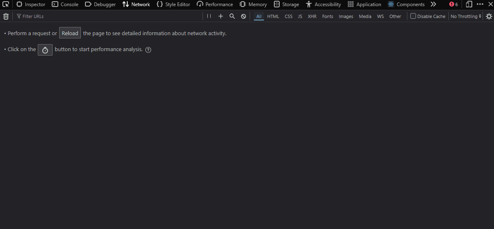
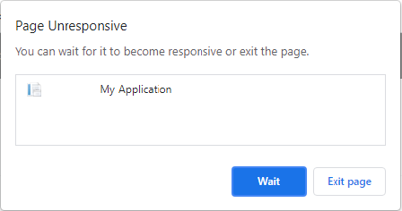

<div style="display:flex; justify-content: center; margin-bottom: 16px;">
  
</div>

<h1 style="color: #fff !important; line-height: 1.1em !important;">Chasing Performance Drifts</h1>
<h2 style="color: #fff !important; line-height: 1.1em !important;">A few recipes that scaled 🧑‍🍳</h2>

<p style="color: #002355; filter: drop-shadow(0 0 8px rgba(255,255,255,0.6))">By Nicolas DUBIEN</p>

---

<h1>Performance matters<span v-click="1">*</span></h1>

<p v-click="1">*even for UI</p>

<p v-click="2">

<br/>

**Marissa Mayer**, then Google VP, in 2006:

> A 500ms delay in search results caused a 20% drop in traffic

<p style="font-size: 0.5em; text-align: right; margin-top: 0px; opacity: 0.5">
  Source:
  <a href="https://glinden.blogspot.com/2006/11/marissa-mayer-at-web-20.html" target="_blank" rel="noopener noreferrer">https://glinden.blogspot.com/2006/11/marissa-mayer-at-web-20.html</a>
</p>

</p>

<p v-click="3">

<br/>

**Greg Linden**, former Amazon engineer, in 2006:

> A 100ms increase in page load time caused a 1% drop in sales

<p style="font-size: 0.5em; text-align: right; margin-top: 0px; opacity: 0.5">
  Source:
  <a href="https://assets.website-files.com/61060433cb5cbb34f58da08c/61065835a1cb346f7673c592_StanfordDataMiningAmazonCaseStudy.pdf" target="_blank" rel="noopener noreferrer">https://assets.website-files.com/61060433cb5cbb34f58da08c/61065835a1cb346f7673c592_StanfordDataMiningAmazonCaseStudy.pdf</a>
</p>

</p>

<!--
  Before we dig on chasing them, let's try to understand why we should care about performance!
  So first thing: it matters! Second one: it matters even for UI!
  
  And one of the best way to justify that is to take two studies that have been done in the past.

  One reported by Marissa Mayer then Google VP in 2006:
  > increasing by 500ms the time it takes to perform a search on Google, dropped the traffic by 20%

  Another by Greg Linden (former Amazon engineer):
  > increasing the page load of Amazon by 100ms reduced sales by 1%

  Both going in the same direction: performance matters, if you get to slow to compute, retrieve and then show the data you users may churn.

  https://assets.website-files.com/61060433cb5cbb34f58da08c/61065835a1cb346f7673c592_StanfordDataMiningAmazonCaseStudy.pdf
  >  +500 ms -20% traffic @ Google
  >  +100 ms -1% sales @ Amazon
  >  Speed matters!
  By Greg Linden (former Amazon engineer)
  https://glinden.blogspot.com/2006/11/marissa-mayer-at-web-20.html
  >  So, Marissa ran an experiment where Google increased the number of search results to thirty. Traffic and revenue from Google searchers in the experimental group dropped by 20%.
  >  Half a second delay caused a 20% drop in traffic. Half a second delay killed user satisfaction.
  By Marissa Mayer then Google VP
  https://www.conductor.com/academy/page-speed-resources/faq/amazon-page-speed-study/
  https://www.gigaspaces.com/blog/amazon-found-every-100ms-of-latency-cost-them-1-in-sales
-->

---

<div :class="{ 'old-bg': true, 'hide-bg': $clicks < 1 }"></div>

<h2 :class="{ 'old-times': $clicks >= 1 }">And one subtle change can ruin it all…</h2>

<p v-click="1" class="old-times">You open your devtools and…</p>



<p v-click="3" class="old-times">
  Such bug happened to  because of <code>useEffect</code>.
  <br/>
  <i style="font-size: 0.9em; opacity: 0.5">Speculative scenario — this talk will show how to quickly spot such bugs</i>
</p>


<!---->

<!--
  So now that we are all aligned that it matters, let me tell you that ensuring it does not drop is not simple.
  All companies got hit one day by such drop.

  Let me take a quite recent case...

  https://www.theregister.com/2025/09/18/cloudflare_ddosed_itself

  ---

  So I'll take an example from a well-known company. A bug you probably have heard of, as it happened quite recently (September 2025).
  Let's imagine you play with the latest version of your UI and you feel it slow... drastically slow...

  So "you open your devtools".

  How they found the bug? Did they detected slownesses manually? Could they have detected them?
  Honestly I don't know, but the issue is the one that happened to Cloudflare.
-->

---
layout: cover
background: https://www.margeride-en-gevaudan.com/wp-content/uploads/2020/01/JSC-PAYSAGES-MARGERIDE-283.jpg
---

<div>
  
</div>

<div style="margin-top: 48px"></div>
<h1 style="color: #fff !important">Chasing Performance Drifts</h1>
<h2 style="color: #fff !important; margin-top: 24px; opacity: 0.9">Nicolas DUBIEN</h2>
<div style="display: flex; justify-content: center; font-size: 1.2em; margin-top: -12px; align-items: end; opacity: 0.9">
  <span style="margin-top: 0.7em">
    Lead Principal Software Engineer at&nbsp;
  </span>
  
</div>
<div style="opacity: 0.7">
 <a href="https://engineering.pigment.com/" target="_blank">engineering.pigment.com</a>
</div>

<div style="margin-top: 24px"></div>
<div style="display: flex; gap: 8px; color: #ffffff; vertical-align: middle; opacity: 0.9">
  
  dubzzz
</div>
<div style="display: flex; gap: 8px; color: #ffffff; vertical-align: middle; opacity: 0.9">
  
  @nicolas.dubien.me
</div>
<div style="display: flex; gap: 8px; color: #ffffff; vertical-align: middle; opacity: 0.9">
  
  fast-check
</div>

---

<div :class="{ 'pigment-bg-1': true }"></div>
<div :class="{ 'pigment-bg-2': true }"></div>

<h1 style="color: #0355f3">Our “fil rouge”<span v-click="4">: The Board</span> </h1>

<p v-click="1" style="color: #5C4420; opacity: 1">Let's rebuild, one after the other, the performance safety nets we built at <b>Pigment</b>.</p>

<div style="display: grid; margin-top: 16px; color: white; text-align: center;">
  <v-switch>
    <template #2>
      <div style="grid-row: 1; grid-column: 1">
        
      </div>
    </template>
    <template #3>
      <div style="grid-row: 1; grid-column: 1">
        
      </div>
    </template>
    <template #4>
      <div style="grid-row: 1; grid-column: 1">
        
      </div>
    </template>
  </v-switch>
</div>

---

<div :class="{ 'pigment-bg-1': true }"></div>
<div :class="{ 'pigment-bg-2': true }"></div>

<h2>The status</h2>


<p v-click="1">✅ Virtualized grids</p>
<p v-click="2">✅ Clever reloads</p>
<p v-click="3">✅ Few customers with rather small grids ~1k cells</p>


---

<div :class="{ 'old-bg': true, 'hide-bg': $clicks < 1 }"></div>
<div :class="{ 'pigment-bg-1': true, 'hide-bg': $clicks >= 1 }"></div>
<div :class="{ 'pigment-bg-2': true, 'hide-bg': $clicks >= 1 }"></div>

<h1 :class="{ 'old-times': $clicks >= 1 }">The first crack</h1>

<p v-click="1" class="old-times">👤 Client: “Our tabs keep crashing”</p>


<p v-click="3" class="old-times">🧑‍💻 Support: “Can't reproduce”</p>
<p v-click="4" class="old-times">👤 Client: “It works fine at first. But after a while this strange message pops!”</p>

<!--
  It means that we are slowly leaking memory.
-->

---

<div :class="{ 'old-bg': true, 'hide-bg': $clicks >= 1 }"></div>
<div :class="{ 'pigment-bg-1': true, 'hide-bg': $clicks < 1 }"></div>
<div :class="{ 'pigment-bg-2': true, 'hide-bg': $clicks < 1 }"></div>

<h2 :class="{ 'old-times': $clicks < 1 }">The culprit</h2>

<p v-click>⏳ Time matters</p>
<p v-click style="margin-left: 32px; margin-top: -12px;">↳ At Pigment, everything is real time</p>
<p v-click style="margin-left: 32px; margin-top: -12px;">↳ Changes may occur when the tab is inactive</p>
<p v-click style="margin-left: 32px; margin-top: -12px;">↳ The UI may redraw itself multiple times in background</p>
<p v-click>🚰 Probably a leak</p>

<p v-click="6">

````md magic-move {lines: true}
```jsx
useEffect(() => {
  const callback = () => {};
  addEventListener("keydown", callback);
  return () => removeEventListener("keyup", callback);
}, [])
```

```jsx
useEffect(() => {
  const callback = () => {};
  addEventListener("keydown", callback);
  return () => removeEventListener("keyup", callback);
}, [])
```

```jsx
useEffect(() => {
  const callback = () => {};
  addEventListener("keydown", callback); // ⬇️ listener
  return () => removeEventListener("keyup", callback);
}, [])
```

```jsx
useEffect(() => {
  const callback = () => {};
  addEventListener("keydown", callback); // ⬇️ listener
  return () => removeEventListener("keyup", callback); // ❌ wrong event type
}, [])
```
````

</p>

---

<div :class="{ 'pigment-bg-1': true }"></div>
<div :class="{ 'pigment-bg-2': true }"></div>

<h2>Let's back ourselves</h2>

<p v-click>🧩 <b>Our need:</b> Detect a leak in user flows</p>

<p v-click>💡 <b>The test strategy:</b></p>
<p v-click style="margin-left: 32px; margin-top: -12px;">↳ Open the app on the homepage</p>
<p v-click :class="{ 'font-bold': $clicks >= 8 }" style="margin-left: 32px; margin-top: -12px;">↳ Count the number of leaky states</p>
<p v-click style="margin-left: 32px; margin-top: -12px;">↳ Run a flow</p>
<p v-click style="margin-left: 32px; margin-top: -12px;">↳ Go back to the homepage</p>
<p v-click :class="{ 'font-bold': $clicks >= 8 }" style="margin-left: 32px; margin-top: -12px;">↳ Count the number of leaky states</p>

<p v-click></p>

---

<div :class="{ 'pigment-bg-1': true }"></div>
<div :class="{ 'pigment-bg-2': true }"></div>

<h2>The implementation</h2>

````md magic-move {lines: true} 
```jsx
// ⚠️ Code shown here is simplified for illustration purposes.
```

```jsx
// ⚠️ Code shown here is simplified for illustration purposes.

function ComponentName(props) {
  useLeakProber(); // no-op in Production
  //...
}
```

```jsx
// ⚠️ Code shown here is simplified for illustration purposes.

function useLeakProber() {
 //...
}
```

```jsx
// ⚠️ Code shown here is simplified for illustration purposes.

function useLeakProber() {
  const [instance] = useState(() => ({}));
}
```

```jsx
// ⚠️ Code shown here is simplified for illustration purposes.

const weakRefs = useRef<WeakRef<object>[]>([]);

function useLeakProber() {
  const [instance] = useState(() => ({}));

  useEffect(() => {
    weakRefs.current.push(new WeakRef(instance));
  }, [probeLeak, instance]);
}
```

```jsx
// ⚠️ Code shown here is simplified for illustration purposes.

const weakRefs = useRef<WeakRef<object>[]>([]);

function useLeakProber() {
  const [instance] = useState(() => ({}));

  useEffect(() => {
    weakRefs.current.push(new WeakRef(instance));
  }, [probeLeak, instance]);
}

function countActiveLeaks() {
  return weakRefs.current.filter((ref) => ref.deref() !== undefined).length;
}
```
````

---

<div :class="{ 'pigment-bg-1': true }"></div>
<div :class="{ 'pigment-bg-2': true }"></div>

<h2>The status</h2>


<p>✅ Virtualized grids</p>
<p>✅ Clever reloads</p>
<p :class="{ 'line-through': $clicks >= 1, 'disappear': $clicks >= 1 }">✅ Few customers with rather small grids ~1k cells</p>
<p v-click>✅ More customers with medium grids, millions of cells</p>

---

<div :class="{ 'old-bg': true, 'hide-bg': $clicks < 1 }"></div>
<div :class="{ 'pigment-bg-1': true, 'hide-bg': $clicks >= 1 }"></div>
<div :class="{ 'pigment-bg-2': true, 'hide-bg': $clicks >= 1 }"></div>

<h1 :class="{ 'old-times': $clicks >= 1 }">The second crack</h1>

<p v-click="1" class="old-times">👤 Client: “Your grid is freezing my browser”</p>
<p v-click="2" class="old-times">🧑‍💻 Support: “Could you tell us more about what you were doing?”</p>
<p v-click="3" class="old-times">👤 Client: “Just pressing arrow keys. One cell to another. Each keystroke hangs for seconds”</p>
<p v-click="4" class="old-times">👤 Client: “Sometimes my browser asks me if I want to kill the page”</p>


---

<div :class="{ 'old-bg': true, 'hide-bg': $clicks >= 1 }"></div>
<div :class="{ 'pigment-bg-1': true, 'hide-bg': $clicks < 1 }"></div>
<div :class="{ 'pigment-bg-2': true, 'hide-bg': $clicks < 1 }"></div>

<h2 :class="{ 'old-times': $clicks < 1 }">The culprit</h2>

<p v-click>🐌 Re-render matters</p>
<p v-click style="margin-left: 32px; margin-top: -12px;">↳ Our "currently selected" state is shared by all cells</p>
<p v-click style="margin-left: 32px; margin-top: -12px;">↳ On updates all cells have to re-render just-in-case</p>

<p v-click>🚚 Move shared state outside of the React tree</p>

---

<div :class="{ 'pigment-bg-1': true }"></div>
<div :class="{ 'pigment-bg-2': true }"></div>

<h2>Let's back ourselves</h2>

<p v-click>🧩 <b>Our need:</b> Limit re-renders <i>at least for critical code paths</i></p>

<p v-click>💡 <b>The test strategy:</b></p>
<p v-click :class="{ 'font-bold': $clicks >= 6 }" style="margin-left: 32px; margin-top: -12px;">↳ Count the number of renders</p>
<p v-click style="margin-left: 32px; margin-top: -12px;">↳ Run a flow</p>
<p v-click :class="{ 'font-bold': $clicks >= 6 }" style="margin-left: 32px; margin-top: -12px;">↳ Count the number of renders</p>

<p v-click></p>

---

<div :class="{ 'pigment-bg-1': true }"></div>
<div :class="{ 'pigment-bg-2': true }"></div>

<h2>The implementation</h2>

````md magic-move {lines: true} 
```jsx
// ⚠️ Code shown here is simplified for illustration purposes.
```

```jsx
// ⚠️ Code shown here is simplified for illustration purposes.

function ComponentName(props) {
  useRenderCount(); // no-op in Production
  //...
}
```

```jsx
// ⚠️ Code shown here is simplified for illustration purposes.

function useRenderCount() {
 //...
}
```

```jsx
// ⚠️ Code shown here is simplified for illustration purposes.

let renderCount = 0;

function useRenderCount() {
  useEffect(() => {
    renderCount += 1;
  });
}
```

```jsx
// ⚠️ Code shown here is simplified for illustration purposes.

const renderCount = new Map<string, number>();

function useRenderCount(kind: string) {
  useEffect(() => {
    renderCount.set(kind, (renderCount.get(kind) ?? 0) + 1);
  });
}
```
````

---

<div :class="{ 'pigment-bg-1': true }"></div>
<div :class="{ 'pigment-bg-2': true }"></div>

<h2>The status</h2>


<p>✅ Virtualized grids</p>
<p>✅ Clever reloads</p>
<p>✅ More customers with medium grids, <span :class="{ 'line-through': $clicks >= 1, 'disappear': $clicks >= 1 }">millions</span><span v-click> billions</span> of cells</p>
<p v-click>✅ Large set of options on each cells</p>

---

<div :class="{ 'old-bg': true, 'hide-bg': $clicks < 1 }"></div>
<div :class="{ 'pigment-bg-1': true, 'hide-bg': $clicks >= 1 }"></div>
<div :class="{ 'pigment-bg-2': true, 'hide-bg': $clicks >= 1 }"></div>

<h1 :class="{ 'old-times': $clicks >= 1 }">The third crack</h1>

<p v-click="1" class="old-times">👤 Client: “The app keeps freezing randomly. Sometimes the whole page becomes unresponsive”</p>



<p v-click="3" class="old-times">🧑‍💻 Support: “We clearly reproduce the issue on your dataset. We are working on it!”</p>

---

<div :class="{ 'old-bg': true, 'hide-bg': $clicks >= 1 }"></div>
<div :class="{ 'pigment-bg-1': true, 'hide-bg': $clicks < 1 }"></div>
<div :class="{ 'pigment-bg-2': true, 'hide-bg': $clicks < 1 }"></div>

<h2 :class="{ 'old-times': $clicks < 1 }">The culprit</h2>

<p v-click>⚡️ Time complexity matters</p>
<p v-click style="margin-left: 32px; margin-top: -12px;">↳ Cells on enums might be backed by million of items</p>
<p v-click style="margin-left: 32px; margin-top: -12px;">↳ That can't fit in memory</p>
<p v-click style="margin-left: 32px; margin-top: -12px;">↳ We fetch them in a cache when first displayed</p>
<p v-click style="margin-left: 32px; margin-top: -12px;">↳ Updating the cache was an O(n)</p>
<p v-click style="margin-left: 32px; margin-top: -12px;">↳ We were not batching updates in such case</p>
<p v-click>🚑️ Long running task</p>


---

<div :class="{ 'pigment-bg-1': true }"></div>
<div :class="{ 'pigment-bg-2': true }"></div>

<h2>Let's back ourselves</h2>

<p v-click>🧩 <b>Our need:</b> Detect long tasks</p>

<p v-click>💡 <b>The test strategy:</b></p>
<p v-click style="margin-left: 32px; margin-top: -12px;">↳ Run a flow</p>
<p v-click :class="{ 'font-bold': $clicks >= 5 }" style="margin-left: 32px; margin-top: -12px;">↳ Check for long tasks</p>

<p v-click></p>

---
layout: cover
background: https://www.margeride-en-gevaudan.com/wp-content/uploads/2020/01/JSC-PAYSAGES-MARGERIDE-283.jpg
---

<div style="text-align: left; display: grid; margin-bottom: 36px; gap: 8px; grid-template-columns: repeat(2, minmax(0, 1fr));">
  <div v-click style="grid-row: 1; grid-column: 1">

### Branded Types

```ts
declare const validX: unique symbol;
export type X = number & { [validX]: true };
export const toX = (x: number) => x as X;
```

  </div>
  <div v-click style="grid-row: 1; grid-column: 2">

### Discriminated Unions

```ts
type Value = NumberValue | TextValue;
```

  </div>
  <div v-click style="grid-row: 2; grid-column: 1">

### Type predicates

```ts
function isValidValue(value: ValueAPI): value is Value {
  // doing stuff
}
```

  </div>
  <div v-click style="grid-row: 2; grid-column: 2">

### Mapped types

```ts
type Value = { [K in Keys]: ValueForK };
```

  </div>
  <div v-click style="grid-row: 3; grid-column: 1">

### \*never

```ts
function assertUnreachable<T>(arg: never, fallback: T) {
  return fallback;
}
```

  </div>
  <div v-click style="grid-row: 3; grid-column: 2">

### Generics & Variadics

```ts
function useAlertOnChange<T extends unknown[]>(
  onChange: (...newValues: T) => void,
  ...subs: { [K in keyof T]: Subscribable<T[K]> },
): void;
```

  </div>
</div>

<h1 style="text-align: right; margin-bottom: 0">Thank you</h1>

<p style="text-align: right">Do not hesitate to visit our blog: <a href="https://engineering.pigment.com/" target="_blank">engineering.pigment.com</a></p>
